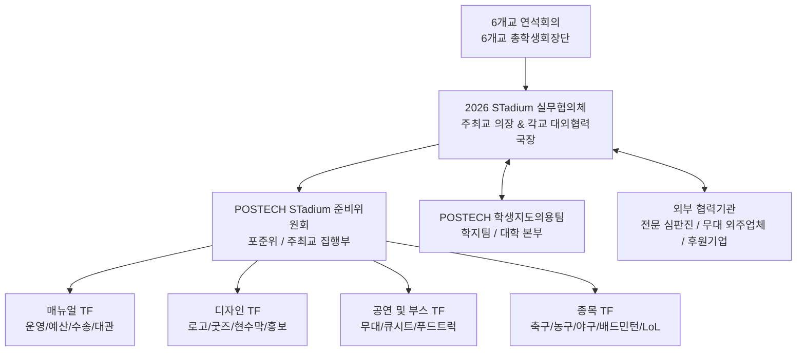

# 0. Architecture (2026 STadium 행사 아키텍처 및 조직 체계)

---

## 1. 개요 및 행사의 정체성
본 문서는 2026년 POSTECH에서 개최되는 6개 이공계 특성화대학(KAIST, GIST, DGIST, UNIST, POSTECH, KENTECH) 연합 스포츠 및 문화 교류전 **2026 STadium**의 조직 거버넌스, 이해관계자 역할, 의사결정 체계, 공간 인프라 아키텍처 및 소통 프로토콜을 정의한 백서 세부 문서이다.

---

## 2. 조직 구조 및 이해관계자 (Organizational Hierarchy & Stakeholders)



### 2.1 핵심 이해관계자 구성원 및 역할

| 구성원 구분 | 주체 및 조직 | 주요 역할 및 담당 업무 |
|---|---|---|
| **최고 의결 기구** | **STadium 6개교 연석회의** | KAIST, GIST, DGIST, UNIST, POSTECH, KENTECH 6개교 총학생회장단. 대회 개최 일정, 주최교 선정, 교비 지출 불가 예산 분담 및 행정 공문 공동 대응 의결. |
| **실무 총괄 기구** | **2026 STadium 실무협의체** | 주최교(POSTECH) 대외협력국장(의장) 및 6개교 대외협력국장/동연회장. 정기 화상 회의(1차~8차), 대진표 추첨, 단권화 규정집 승인 및 종합 인수인계. |
| **주최교 집행 기구** | **POSTECH 준비위원회 (포준위)** | POSTECH 총학생회 중앙집행위원회 및 STadium 특임위원회. 행사 현장 총괄 및 분과별 TF(매뉴얼, 디자인, 공연/부스, 종목) 진두지휘. |
| **- 매뉴얼 TF** | 포준위 매뉴얼 분과 | 종합 운영 타임라인 수립, 가예산 편성(상한/하한), 외부 장소 대관 및 예치금 계약, 타 대학 대절버스 주차 수송망 관리. |
| **- 디자인 TF** | 포준위 디자인 분과 | 2026 STadium 공식 로고, 스포츠타올, 슬로건, 인스타그램 카드뉴스 틀, 현수막 및 팜플렛 디자인 제작. |
| **- 공연 및 부스 TF** | 포준위 공연/부스 분과 | E1/체육관 무대 큐시트 작성, 외부 음향/조명 업체 계약, 공연자 서약서 집행, 부스 및 푸드트럭(닭강정, 분식, 타코야끼 3종) 섭외. |
| **- 종목 TF** | 포준위 종목 분과 | 축구, 농구, 야구, 배드민턴, e-스포츠(LoL) 종목별 담당자(윤석영, 홍준우, 양광모, 이희재, 김태승 등) 지정, 규칙 단권화 및 심판진 위촉. |
| **대학 본부 지원** | **POSTECH 학생지도의용팀 (학지팀)** | 행정 예산 배정(약 2,275만 원 규모), 교내 시설(대운동장, 체육관, 콜로세움) 사용 승인 및 안전/보건 행정 지원. |
| **외부 협력 기구** | **전문 심판진 & 외주 용역업체** | 축구/농구/야구/배드민턴 대한·지역 스포츠협회 전문 심판진 위촉, 무대 전문 음향·조명 업체, 동문 기업 후원사(뉴로메카, 머플, DLG 등). |

---

## 3. 의사결정 체계 및 소통 프로토콜 (Decision-Making & Communication)

1. **상면 의결 단계 (Top-Level Hierarchy)**
   - **연석회의**: 국가적 비상 이슈, 교비 지출 불가 항목(농구 심판비 등) 타교 분담, 주최교 변경 등 중대 안건 의결.
2. **실무 협의 단계 (Operational Hierarchy)**
   - **실무협의체 정기 회의**: 매월 정기 화상 회의를 개회하여 종목별 엔트리 기한(행사 10일 전), 무대 타임테이블, 주차 동선 등을 협의.
3. **종목 및 공연 현장 단계 (Execution Hierarchy)**
   - **종목별 카카오톡 대표자 단톡방**: 주최교 종목 담당자(TF)와 6개교 운동 동아리 주장의 1:1 및 전체 단톡방 구축. 경기 직전 '대표자-심판진 룰 미팅' 의무화.
   - **무대 백스테이지 통제방**: 무대 감독, 음향 엔지니어, 공연 동아리 대표 간 실시간 큐시트 조정.
4. **현장 비상 에스컬레이션 (Incident Escalation)**
   - 현장 판정 시비 또는 장비 결함 발생 시: `현장 스태프 ➔ 주최교 종목 담당자 ➔ 포준위 위원장 ➔ 실무협의체 긴급 연석회의` 순으로 15분 이내 중재 처리.

---

## 4. 공간 및 인프라 아키텍처 (Venue Architecture)

```
[POSTECH 메인 캠퍼스]
├── POSTECH 대운동장 ─────── 축구 경기 (인조잔디, 야외 관람) & 개회식 도열
├── POSTECH 체육관 ───────── 농구 / 배드민턴 경기 (실내 전천후) & 무대 공연 / 폐회식
├── POSTECH 콜로세움/복합관 ── e-스포츠 (LoL 예선/본선/결선 및 관람 중계)
└── 오룡관 앞 / 기계동 잔디 ── 부스 존 & 푸드트럭 3종 (닭강정, 분식, 타코야끼)

[교외 대관 시설]
└── 곡강 시민 야구장 ──────── 야구 경기 (45인승 셔틀 버스 수송망 연결)
```

1. **교내 공간 집약 배치**
   - 축구(대운동장), 농구/배드민턴/무대(체육관), e-스포츠(콜로세움)를 POSTECH 본원 내 도보 5~10분 거리로 집약 배치하여 관람객 동선 파편화 방지.
2. **교외 경기장 수송 아키텍처**
   - 야구 경기는 정규 규격을 갖춘 교외 경기장(곡강 시민 야구장 또는 포항 생체 야구장)을 대관하고, 45인승 셔틀버스를 30분 간격으로 운행.
3. **부스 및 식사 인프라 레이아웃**
   - 체육관 및 잔디밭 주변에 3종 푸드트럭 및 체험 부스(LoL 아이템 상점, 스피드건 체험 등)를 배치하고, 주말 교내 지곡회관/학생식당 1층 전체를 식사 쉼터로 개방.

---

## 5. 추진 타임라인 및 마일스톤 (Timeline & Milestones)

| 추진 시기 | 주요 마일스톤 | 핵심 세부 과제 |
|---|---|---|
| **3월** | **TF 구성 및 1차 기획** | 포준위 TF 구성(매뉴얼, 디자인, 공연/부스), 1~3차 TF 회의 개회, 장소 및 가예산안(상한/하한) 수립. |
| **4월** | **실무협의체 발족 및 룰 작성** | 학지팀 미팅, 각 종목별 세부 규칙 초안 작성(~4/1), 운동 동아리 미팅(4/20~4/26), 6개교 실무협의체 1차 회의. |
| **5월~8월** | **디자인·대관·후원 확정** | 공식 로고/굿즈 디자인 확정, 외부 야구장 및 PC방 대관 검증, 동문 기업 후원 유치 메일 발송, 푸드트럭 섭외. |
| **9월~10월** | **엔트리·큐시트 확정** | 각교 대표선발전 진행, 엔트리 명단 확정(행사 10일 전), 무대 서약서 수령 및 큐시트 픽스, 인력배치 매뉴얼 최종 검수. |
| **11월 (D-Day)** | **행사 개최 및 인수인계** | 2026 STadium 1일 단일통합 행사 개최 ➔ 결산 회의 및 2027 차기 주최교(KAIST) 종합 인수인계. |
