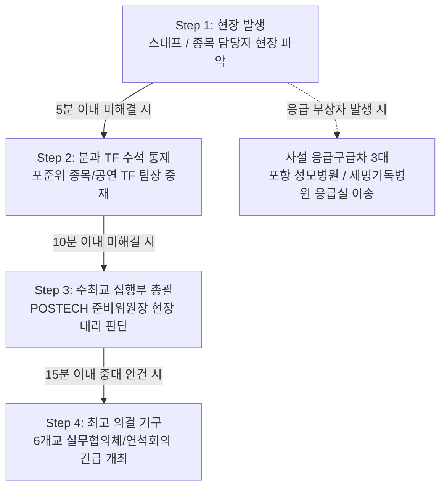

# II. Operational Considerations & Risk Mitigation (2026 STadium 운영 고려사항 및 리스크 방안)

---

## 1. 개요 및 분석 배경 (Overview & Analysis Background)

본 문서는 **2026 STadium (POSTECH 개최)**의 성공적인 완수와 무결점 운영을 위하여, 과거 4개년(2022년 KAIST, 2023년 UNIST, 2024년 DGIST, 2025년 GIST) 동안 실제로 발생한 **21개 핵심 문제점 및 피드백 데이터**를 전수 분석하고, 이를 바탕으로 2026년 POSTECH 준비위원회(포준위)와 실무협의체가 사전 통제해야 할 분야별 리스크 대응 매뉴얼과 비상 프로토콜을 수립한 백서 세부 문서이다.

- **대상 구성원**: 2026 STadium 실무협의체 의장, 포준위 위원장, 매뉴얼 TF, 디자인 TF, 공연/부스 TF, 종목 담당자(축구, 농구, 야구, 배드민턴, LoL), 수송/안전 담당자, POSTECH 학지팀/시설팀.
- **핵심 목표**: 
  1. 과거 4개년 21개 문제점의 재발 가능성을 근본적으로 차단하는 **사전 예방 매뉴얼(Pre-Control System)** 구축.
  2. 행정, 경기, 무대, 공간, 시설, 식사/수송, 안전 등 7대 분야별 **리스크 대응 체크리스트** 수립.
  3. 비상 상황 발생 시 15분 이내 해결을 보장하는 **비상 에스컬레이션(Escalation) 체계** 정립.

---

## 2. 7대 핵심 분야별 리스크 대응 매뉴얼 & 체크리스트

### 2.1 행정 · 대외협력 & 소통 (Administration & Communication)
- **비상 공문 및 행정 대응 체계 구축**: 국가적 비상 이슈나 대학 본부의 행정 제재 발생 시, 6개교 연석회의(총학생회장단)를 1시간 이내 즉시 개회하여 공동 입장 공문을 채택하고 대응한다.
- **교비 지출 불가 예산 사전 타결**: 농구/축구 심판비 등 대학 교비 직접 지출이 불가능한 항목을 행정 미팅 단계(행사 2개월 전)에서 사전에 분류하고, 6개교 실무협의체 협약을 통해 타교 지원금 또는 각교 학생회비 분담 구조를 확정한다.
- **주최교 내부-학생회 소통 채널 단권화**: 포준위 위원장, 분과별 TF 팀장, 종목 담당자 간 핫라인을 개설하고, 실무협의체 공지 및 종목별 대표자 단톡방 개설 일정을 체크리스트로 사전 관리한다.

| 분야 | 체크리스트 항목 | 검수 시기 | 담당 주체 |
|---|---|---|---|
| 행정 | 교비 지출 불가 항목 분류 및 6개교 분담 협약 체결 여부 | D-60 | 실무협의체 의장 / 매뉴얼 TF |
| 행정 | 비상 상황 대응 6개교 연석회의 긴급 소집 핫라인 구축 | D-30 | 6개교 총학생회장단 |
| 소통 | 종목별 카카오톡 대표자 단톡방 개설 및 인력 명단 확정 | D-14 | 포준위 종목 TF / 6개교 대표자 |
| 행정 | 신규/참여 대학(KENTECH 등) 원기 및 단체 깃발 제작 상태 검수 | D-30 | 매뉴얼 TF / 참가교 대외협력국 |

---

### 2.2 경기 규칙 · 판정 & 전문 심판진 (Rules & Officiating)
- **STadium 통합 경기 규정집 사전 확정**: 5개 종목(축구, 농구, 야구, 배드민턴, e-스포츠) 규정을 단권화하고, 행사 30일 전 6개교 실무협의체 최종 승인을 거쳐 공표한다.
- **전문 심판진 서면 계약 및 룰 미팅 의무화**: 대한/지역 스포츠협회 소속 전문 심판진 위촉 시 작성된 규정집 준수 의무를 계약서에 명시하고, 경기 시작 30분 전 '선수단 대표자 - 전문 심판진 간 룰 미팅'을 의무 개최한다.
- **e-스포츠(LoL) 계정 및 신분 검증 강화**: 본인 명의 계정 사용을 원칙으로 하며, 부득이한 가족 명의 계정 사용 시 모바일 증빙 서류(가족관계증명서 등)를 D-7까지 사전 제출받아 본부 스태프가 현장에서 1:1 신분을 확인한다.

| 분야 | 체크리스트 항목 | 검수 시기 | 담당 주체 |
|---|---|---|---|
| 경기 | 5개 종목 'STadium 통합 경기 규정집' 단권화 및 승인 | D-30 | 종목 TF / 실무협의체 |
| 경기 | 대한/지역 스포츠협회 전문 심판진 서면 계약 체결 | D-14 | 종목 TF / 포준위 |
| 경기 | 경기 당일 대표자-심판진 사전 룰 미팅 진행 여부 | D-Day (경기전) | 종목 담당 스태프 |
| 경기 | e-스포츠 본인 명의 계정 증빙 서류 제출 및 현장 대조 | D-7 ~ D-Day | e-스포츠 담당자(김태승) |

---

### 2.3 무대 기획 · 공연 & 타임테이블 (Stage & Schedule)
- **무대 장소 전략적 선정**: POSTECH 포항 캠퍼스의 11월 야간 강풍 및 한파를 고려하여, 기상 영향을 차단할 수 있는 **POSTECH 체육관(실내 무대)** 활용을 기본 플랜(Plan A)으로 확정한다.
- **백스테이지 셋팅 버퍼 15분 의무 반영**: 큐시트 작성 시 팀 간 셋팅 및 리허설 버퍼 시간을 최소 15분 이상 필수 반영하여 악기 이동 및 세팅 딜레이를 흡수한다.
- **악기 스펙 사전 동결 및 외주 업체 전달**: 26개 참여 동아리의 개인 악기 및 공용 악기(드럼, 앰프, 키보드) 목록을 행사 3주 전 동결하고 외주 음향/조명 감독에게 서면 전달하여 현장 세팅 착오를 차단한다.

| 분야 | 체크리스트 항목 | 검수 시기 | 담당 주체 |
|---|---|---|---|
| 무대 | 무대 외주 용역업체 계약 및 음향/조명 상세 스펙 확정 | D-30 | 공연/부스 TF |
| 무대 | 26개 공연 동아리 악기 목록 동결 및 외주 감독 공유 | D-21 | 공연/부스 TF |
| 무대 | 큐시트 내 팀별 백스테이지 셋팅 버퍼(15분) 배치 점검 | D-14 | 공연/부스 TF |
| 무대 | 댄스 플로어 매트 4면 고정 테이핑 및 안전 상태 검수 | D-1 | 공연/부스 TF / 외주업체 |

---

### 2.4 공간 동선 · 배치 & 중계 (Space Layout & Broadcasting)
- **POSTECH 본원 캠퍼스 내 공간 집약적 배치**: 대운동장(축구), 체육관(농구/배드민턴/무대), 콜로세움(e-스포츠), 지곡회관(식사/부스)을 도보 5~10분 이내 구역으로 집약하여 관람객 동선 파편화를 방지한다.
- **e-스포츠 이원화 중계 및 관람석 구축**: 콜로세움 및 대형 강의실에 유선 LAN 인터넷 망을 확보하고 실시간 관전 중계 시스템 및 전문 해설진을 배치한다.
- **교외 경기장 수송 셔틀 운행**: 교외 야구장(곡강 시민 야구장) 대관 시 45인승 대절 버스 셔틀(30분 간격)을 배치하고 배송 도시락망을 구축한다.

| 분야 | 체크리스트 항목 | 검수 시기 | 담당 주체 |
|---|---|---|---|
| 공간 | 교내 축구-농구-배드민턴-무대-부스 도보 동선 레이아웃 점검 | D-30 | 매뉴얼 TF / 포준위 |
| 공간 | e-스포츠 전용 유선 LAN IP 및 다원 중계 시스템 작동 테스트 | D-7 | e-스포츠 담당자 / 디자인 TF |
| 공간 | 교외 야구장 셔틀 버스 타임테이블 수립 및 운전기사 브리핑 | D-7 | 수송 담당자 / 매뉴얼 TF |

---

### 2.5 시설 · 인프라 · 전력 & 부대 대관 (Facility & Power Infrastructure)
- **전력 용량 및 배전반 현장점검**: 무대 및 부스 예정지의 메인 전력 용량(최소 20kW 이상)을 사전 점검하고, 산업용 연장 릴선 및 배전반 배선 작업을 완료한다.
- **교외 경기장 부대시설 체크리스트 서면 검증**: 곡강 야구장 등 교외 시설 대관 시 전광판(스코어보드) 작동 여부, 기록용 통신 네트워크, 샤워시설 온수 공급 여부를 사전 확인하고 미비 시 별도 렌탈(전광판 렌탈 등) 조치를 완료한다.
- **교내 샤워실 온수 연장 협의**: POSTECH 체육관 샤워실 온수를 행사 당일 22:00까지 연장 공급하도록 시설팀과 공문 협의를 완료한다.

| 분야 | 체크리스트 항목 | 검수 시기 | 담당 주체 |
|---|---|---|---|
| 시설 | 메인 무대 전력 용량(20kW+) 및 산업용 릴선 현장 테스트 | D-7 | 공연/부스 TF / 시설팀 |
| 시설 | 교외 야구장 스코어보드 전광판 작동 및 통신망 배선 검증 | D-14 | 종목 TF (야구 담당) |
| 시설 | 체육관 샤워실 주말 온수 연장 운영(22시까지) 공문 처리 | D-21 | 매뉴얼 TF / 학지팀 |

---

### 2.6 식사 · 편의 & 수송 인프라 (Catering & Transportation)
- **주말 교내 식당 전체 개방 및 제휴**: 주말 식당 휴무에 대응하여 지곡회관/학생식당 1층 전체를 참가자 식사/휴식 공간으로 개방하고, 2층 분식집 특수 영업 및 지정 단체 도시락(본도시락 등) 공동구매 수송망을 수립한다.
- **대절 버스 수송망 물리적 동선 통제**: 타 대학에서 도착하는 16~20대의 45인승 대형 버스 하차 구역(대강당 앞), 장기 주차 구역, 퇴장 동선을 물리적으로 분리하고 주차 라인 차단봉 및 전담 스태프 2인을 배치한다.

| 분야 | 체크리스트 항목 | 검수 시기 | 담당 주체 |
|---|---|---|---|
| 식사 | 학생식당 전체 실내 공간 개방 및 단체 도시락 업체 지정 | D-14 | 매뉴얼 TF / 식당 관리처 |
| 수송 | 타교 대절버스(16~20대) 주차 동선 분리 및 가이드라인 수립 | D-7 | 수송 담당 스태프 |
| 편의 | 참가자 전원 식권/쿠폰 배부 및 실내 쉼터 안내 현수막 설치 | D-1 | 매뉴얼 TF / 디자인 TF |

---

### 2.7 안전 · 위생 · 기상 & 방한 (Safety, Sanitation & Weather)
- **사설 응급 구급차 3대 풀타임 운용**: 대운동장(축구/개회식), 체육관(농구/배드민턴/무대), 곡강 야구장 3개 핵심 거점에 사설 구급차 및 응급구조사를 풀타임 배치한다.
- **한파/강풍 대비 방한 버퍼 예산 편성**: 1인당 핫팩 2~3개(총 2,500개 이상)를 사전 확보하고 야외 관람석 방한 무릎담요를 구비한다.
- **쓰레기 자진 수거 보증금제 도입**: 쓰레기 무단 투기 방지를 위해 학교당 10만 원의 청소 보증금을 예치받고, 경기 종료 후 전용 100L 쓰레기 봉투 수거 확인 시 보증금을 반환한다.

| 분야 | 체크리스트 항목 | 검수 시기 | 담당 주체 |
|---|---|---|---|
| 안전 | 사설 응급 구급차 3대 계약 및 응급구조사 배치 점검 | D-14 | 안전 담당자 / 매뉴얼 TF |
| 안전 | 전 참가자 및 관람객 여행자보험 통합 가입 완료 | D-5 | 매뉴얼 TF |
| 방한 | 핫팩(2,500개+) 사전 구매 및 야외 거점 배치 | D-3 | 안전 담당자 / 포준위 |
| 위생 | 쓰레기 자진 수거 보증금제 안내 및 100L 봉투 거점 설치 | D-7 | 안전/위생 담당 스태프 |

---

## 3. 과거 4개년 21개 문제점 전수 대응 마트릭스 (4-Year Risk Mitigation Matrix)

과거 2022~2025년 STadium 교류전에서 실재했던 **21개 발생 문제점**에 대해 2026 POSTECH 개최 시 적용할 전수 사전 통제 대책(Mitigation Plan)은 다음과 같다.

### A. 행정 · 대외협력 · 조직 운영 (4개 항목)

| 번호 | 연도 | 과거 발생 문제 (Problem) | 원인 및 과거 해결책 | 2026 POSTECH 개최 사전 통제 대책 (Mitigation) | 책임 주체 및 검수 타임라인 |
|---|---|---|---|---|---|
| 1 | 2022 | 국가 애도기간 및 학교측 행사 취소 통보 | 이태원 참사 발생으로 본부의 연기/취소 통보 ➔ 5개교 연석회의 긴급 개회 및 공동 입장 공문 작성으로 설득 성공. | 비상 상황 발생 시 6개교 연석회의 1시간 이내 개회 프로토콜 사전 정립 및 학지팀-포준위 비상 연락망 공유. | 6개교 총학생회장단 / D-30 |
| 2 | 2023 | 농구 전문 심판비 교비 지출 불가 문제 | 행정 규정상 교비 직접 집행 불가 ➔ 실무협의체 긴급 의결로 GIST/POSTECH 각 14만 원, UNIST 15만 원 학생회비 분담 처리. | 행사 2개월 전 교비 지출 불가 항목 전수 분류 완료 및 6개교 실무협의체 분담 협약서 사전 체결. | 실무협의체 의장 / D-60 |
| 3 | 2024 | e-스포츠 종목 대표자 단톡방 개설 지연 | 주최교 내부 담당자 소통 차질 ➔ 사과문 게시 및 즉시 명단/규정 확정. | 포준위 종목 TF 내 e-스포츠 담당자(김태승) 지정, 단톡방 개설 마일스톤(D-14) 미준수 시 포준위 위원장 개입 통제. | e-스포츠 담당자 / D-14 |
| 4 | 2025 | 신생 학교(KENTECH) 원기 미제작 문제 | KENTECH 원기 납기 지연 가능성 ➔ 당일 KENTECH 팻말로 대체 행진 허용. | 행사 1개월 전 6개교 원기 및 단체 깃발 상태 현물 점검 완료, 미제작 시 주최교(POSTECH)에서 규격 팻말 선제 제작 배치. | 매뉴얼 TF / D-30 |

---

### B. 경기 규칙 · 판정 및 전문 심판진 (4개 항목)

| 번호 | 연도 | 과거 발생 문제 (Problem) | 원인 및 과거 해결책 | 2026 POSTECH 개최 사전 통제 대책 (Mitigation) | 책임 주체 및 검수 타임라인 |
|---|---|---|---|---|---|
| 5 | 2022 | 경기 판정 시비 및 규칙 해석 차이 | 대학 간 라이벌전 특성 ➔ 종목별 매뉴얼 사전 확정 및 전문 심판진 대거 위촉. | '2026 STadium 통합 경기 규정집' 단권화 작성 및 경기 시작 30분 전 '선수단 대표자 - 전문 심판진 룰 미팅' 의무화. | 종목 TF 팀장 / D-30 |
| 6 | 2023 | 경기 매뉴얼 일부 종목 규칙 모호성 | 농구 데드타임, e-sports 설정 모호 ➔ 현장 중재 후 단권화 개정 추진. | 종목별 세부 매뉴얼 내 데드타임, 연장전, 교체 인원, 비디오 판정 여부 등 예외 조항을 완전 명기하고 사전 승인. | 종목별 담당자 / D-21 |
| 7 | 2024 | 야구 경기 심판 매뉴얼 미준수 논란 | 외부 심판진에 매뉴얼 사전 전달 미흡 ➔ 연석회의로 안건 이관 후 승부치기 조율 및 사과. | 외부 체육회 심판 위촉 시 'STadium 규정집 준수 의무'를 서면 계약서에 포함하고, 경기 전 본부 스태프 동석 하 룰 점검. | 야구 담당자(양광모) / D-14 |
| 8 | 2025 | e-스포츠(LoL) 본인 명의 계정 미보유 | 가족 계정 참가 시도 ➔ 모바일 가족관계증명서 제출 및 현장 신분 확인. | e-스포츠 참가자 계정 사전 제출(D-7) 및 예외 계정 시 모바일 증빙 사전 검수, 경기 20분 전 본부 스태프 현장 1:1 대조. | e-스포츠 담당자 / D-7 |

---

### C. 무대 기획 · 공연 및 타임테이블 (3개 항목)

| 번호 | 연도 | 과거 발생 문제 (Problem) | 원인 및 과거 해결책 | 2026 POSTECH 개최 사전 통제 대책 (Mitigation) | 책임 주체 및 검수 타임라인 |
|---|---|---|---|---|---|
| 9 | 2022 | 포스텍 밴드 동아리 중도 공연 포기 | 연습 불가, 셋팅시간 부족, 시험 중복 ➔ 80분 제한 원칙 안내 및 버퍼 확보. | 동아리 사전 여건 조사 실시, 팀당 백스테이지 셋팅 버퍼 15분 의무 반영, 11월 초 시험기간과 중복되지 않도록 타임테이블 확정. | 공연/부스 TF / D-30 |
| 10 | 2023 | 무대 리허설 딜레이 발생 (30분 지연) | 동아리 장비 결함 및 셋팅 과다 ➔ 본 무대 타이트 통제로 만회. | 참여 26개 동아리 악기 목록 행사 3주 전 동결, 키보드/앰프 등 공용 악기 작동 상태 D-3 사전 검수 및 셋팅 버퍼 15분 확보. | 공연/부스 TF / D-21 |
| 11 | 2024 | 무대 리허설 및 공연 시간 딜레이 | 악기 혼용 및 외주 업체의 세팅 착오 ➔ 버퍼 축소 & 폐회식/무대 투트랙 진행. | 외주 음향/조명 감독 대상 상세 큐시트 및 악기 스펙 사전 브리핑, 밴드 장비를 전반부에 몰아서 배치하여 악기 교체 최소화. | 공연/부스 TF / D-14 |

---

### D. 공간 동선 · 공연장/경기장 배치 · 중계 (3개 항목)

| 번호 | 연도 | 과거 발생 문제 (Problem) | 원인 및 과거 해결책 | 2026 POSTECH 개최 사전 통제 대책 (Mitigation) | 책임 주체 및 검수 타임라인 |
|---|---|---|---|---|---|
| 12 | 2022 | 야구장 홈런 및 인프라 라인 판정 모호성 | 교내 임시 야구장 활용 ➔ 콘(Cone) 설치로 경계선 수립 및 주심 직권 부여. | 정규 규격을 갖춘 포항 관내 교외 전문 야구장(곡강 시민 야구장)을 사전 대관하여 라인 모호성 근본 차단. | 종목 TF (야구) / D-45 |
| 13 | 2022 | e-스포츠(LoL) 관람 및 중계 공간 제약 | 외부 PC방 이용으로 관람객 직접 수용 불가 ➔ 터만홀 대여 및 유선랜 IP 15개 중계관람석 운영. | POSTECH 콜로세움/복합관을 중계 메인 관람석으로 지정, 대형 전광판 관전 화면 배출 및 전문 해설진 현장 배치. | e-스포츠 담당자 / D-14 |
| 14 | 2024 | 경기장과 공연장 분리에 따른 집중도 저하 | 교외 경기장 및 시설 이원화로 응원 분위기 분산 ➔ 실시간 스코어 중계 및 SNS 경품 이벤트. | POSTECH 본원 내 도보 5~10분 거리에 축구-농구-배드민턴-무대-부스 집약 배치, 경기장 간 이동 셔틀 및 실시간 스코어 보드 가동. | 매뉴얼 TF / 디자인 TF / D-30 |

---

### E. 시설 · 인프라 · 전력 및 부대 대관 (3개 항목)

| 번호 | 연도 | 과거 발생 문제 (Problem) | 원인 및 과거 해결책 | 2026 POSTECH 개최 사전 통제 대책 (Mitigation) | 책임 주체 및 검수 타임라인 |
|---|---|---|---|---|---|
| 15 | 2023 | 농구 경기 시 샷클락 전원 및 안경 착용 문제 | 리드선 미비 및 심판 안경 제한 당일 통보 ➔ 15m 릴선 긴급 수급, 안경 미착용 안내. | 종목별 경기 장비 체크리스트(샷클락, 릴선 20m+) 사전 작성 및 전문 심판진 룰북(스포츠 고글 허용 등) 사전 공지. | 농구 담당자(홍준우) / D-14 |
| 16 | 2025 | 잔디밭 개회식 전력 및 플랜카드 고정 불가 | 전력 한계 및 고정 구조 문제 ➔ 개회식을 축구장으로 변경, 무대/부스 분리 배치. | 개회식 및 행진 장소를 전력과 도열이 완비된 POSTECH 대운동장/체육관으로 확정, 무대 주변 메인 배전반 전력 용량(20kW+) 점검. | 공연/부스 TF / D-21 |
| 17 | 2025 | 외부 야구장 전광판 및 통신 네트워크 부재 | 외부 야구장 부대시설 미비 ➔ 전광판 별도 렌탈 및 LAN선 배선 긴급 집행. | 교외 야구장 사전 현장점검 시 스코어보드 전광판 작동 및 통신망 배선 여부 서면 검증, 미비 시 D-14 전광판 렌탈 계약 완료. | 야구 담당자 / D-30 |

---

### F. 식사 · 편의 · 수송 인프라 (2개 항목)

| 번호 | 연도 | 과거 발생 문제 (Problem) | 원인 및 과거 해결책 | 2026 POSTECH 개최 사전 통제 대책 (Mitigation) | 책임 주체 및 검수 타임라인 |
|---|---|---|---|---|---|
| 18 | 2024 | 체육관 샤워 온수 중단 및 식당/휴식 제약 | 체육관 17시 온수 중단 및 식당 제약 ➔ 인근 사우나 안내 및 선결제 지원. | POSTECH 체육관 샤워실 온수 연장 운영(22:00까지) 시설팀 공문 승인 완료 및 주말 식당 1층 전체를 온열 쉼터로 개방. | 매뉴얼 TF / 학지팀 / D-21 |
| 19 | 2025 | 주말 교내 식당 휴무 및 대규모 식사 한계 | 주말 식당 대부분 휴무 ➔ 외부 도시락 공동구매, 1학 2층 특수 운영, 식당 개방. | 주말 지곡회관/학생식당 개방, 단체 도시락 지정 업체 제휴, 푸드트럭 3종(닭강정, 분식, 타코야끼) 배치를 통한 식사 수용량 확보. | 매뉴얼 TF / 공연/부스 TF / D-14 |

---

### G. 안전 · 기상 · 환경 및 위생 (2개 항목)

| 번호 | 연도 | 과거 발생 문제 (Problem) | 원인 및 과거 해결책 | 2026 POSTECH 개최 사전 통제 대책 (Mitigation) | 책임 주체 및 검수 타임라인 |
|---|---|---|---|---|---|
| 20 | 2023 | 한파로 인한 핫팩 및 방한 물품 부족 | 급격한 기온 저하 ➔ 현장 예산으로 핫팩 100개 추가 즉시 구매 공급. | 1인당 핫팩 2~3개 기준 방한 예산 사전 편성(핫팩 2,500개 이상 사전 구매), 야외 관람석 무릎담요 및 온열 히터 사전 설치. | 안전 담당자 / D-7 |
| 21 | 2023 | 쓰레기 무단 투기 및 분리수거 미흡 | 대운동장 담배꽁초 및 음료 쓰레기 방치 ➔ 집행부 전원 수거 청소 진행. | 대학별 '쓰레기 자진 수거 보증금제(학교당 10만 원)' 도입, 경기장/무대 관람석 100L 분리수거 봉투 거점배치 및 청소 검수. | 안전/위생 담당자 / D-7 |

---

## 4. 2026 POSTECH 특화 사전 통제 및 비상 대응 프로토콜

### 4.1 비상 이슈 발생 시 에스컬레이션 체계 (Incident Escalation)

현장에서 판정 시비, 장비 결함, 부상자 발생, 기상 악화 등 비상 상황이 발생할 경우 **15분 이내 처리**를 원칙으로 하는 4단계 에스컬레이션 프로토콜을 가동한다.



1. **Step 1 (현장 1차 중재 - 5분 이내)**: 경기장/무대 현장 스태프 및 포준위 종목/공연 담당자가 규정집에거하여 1차 중재.
2. **Step 2 (분과 TF 통제 - 10분 이내)**: 현장 중재 불복 시 포준위 해당 분과 TF 팀장(윤석영, 홍준우 등)이 대표자 및 심판진과 최종 룰 대조.
3. **Step 3 (주최교 집행부 총괄 - 15분 이내)**: 중대 판정 시비 시 포준위 위원장이 현장에서 대회 집행 권한으로 최종 중재안 제시.
4. **Step 4 (최고 의결 기구 - 긴급 상정)**: 경기 중단, 주최교 변경, 안전 비상 사태 등 최고 안건 발생 시 6개교 실무협의체 의장 및 6개교 총학생회장단 긴급 화상/상면 연석회의 개회 후 표결 처리.

---

### 4.2 POSTECH 공간 집약 동선 관리 프로토콜

POSTECH 본원 캠퍼스의 공간적 장점을 극대화하여 **도보 5~10분 이동 동선**을 구축한다.

```
[POSTECH 대운동장] ───────── (도보 3분) ─────────> [POSTECH 체육관]
 (축구 / 개회식 도열)                              (농구 / 배드민턴 / 무대 공연)
         │                                                 │
     (도보 5분)                                        (도보 4분)
         ▼                                                 ▼
[오룡관 앞 / 잔디밭] ───────── (도보 2분) ─────────> [POSTECH 콜로세움]
(부스 존 & 푸드트럭 3종)                          (e-스포츠 LoL 관람 중계)
```

- **대운동장 ↔ 체육관 동선**: 개회식 직후 농구/배드민턴 참가자 및 관람객이 안전 펜스를 따라 이동할 수 있도록 야외 꼬깔(Cone) 동선 가이드라인 설치.
- **체육관 ↔ 지곡회관(식당) 동선**: 식사 시간대 관람객 몰림 현상을 방지하기 위해 실내 쉼터 안내 입간판 및 현수막 배치.

---

### 4.3 교외 곡강 야구장 인프라 사전 검수 프로토콜

교외 대관 시설인 **곡강 시민 야구장** 활용 시 아래 5대 필수 항목을 서면 체크리스트로 사전 검수한다.

```
[곡강 야구장 사전 검수 체크리스트]
  [ ] 1. 스코어보드 전광판 정상 작동 및 컨트롤러 상태 (미비 시 전광판 렌탈)
  [ ] 2. 경기 기록원 및 중계 스태프용 유선 LAN 통신망 배선 여부
  [ ] 3. 선수단 대기석(덕아웃) 방풍 텐트 및 핫팩/온열기 배치 가능 여부
  [ ] 4. 체육관/덕아웃 샤워실 온수 공급 상태 및 수압 점검
  [ ] 5. POSTECH 대강당 ↔ 곡강 야구장 간 45인승 셔틀버스(30분 간격) 운행 도로 점검
```

---

### 4.4 기상 변수 (11월 강풍 · 한파 · 우천) A/B 플랜 시나리오

포항 지역의 11월 기상 특성(해풍, 기온 급강하, 우천)에 대비한 **대응 플랜(Plan A/B)**을 다음과 같이 사전 수립한다.

| 기상 변수 | 발생 조건 | Plan A (정상 진행 플랜) | Plan B (비상 우천/한파 플랜) |
|---|---|---|---|
| **한파 및 강풍** | 야간 기온 5℃ 이하<br/>풍속 8m/s 이상 | 대운동장/잔디밭 야외 부스 운영,<br/>관람석 핫팩(1인당 2~3개) 및 무릎담요 배부. | **무대 공연 전체를 POSTECH 체육관 실내로 전환**, 야외 관람석 대형 파티오 히터 6대 긴급 가동. |
| **우천 (소우)** | 강수량 5mm 미만 | 우의(1,000개 사전 확보) 배부 후<br/>축구, 야구, 부스 정상 진행. | 야구 경기 승부치기 규정 적용 및 이닝 축소,<br/>잔디밭 부스를 오룡관/체육관 로비 실내로 이동. |
| **우천 (폭우)** | 강수량 5mm 이상<br/>호우주의보 발령 | 연석회의 긴급 개회 및 1시간 대기. | **야외 경기(축구, 야구) 중단 및 승부차기/e-스포츠 대체**, 체육관(농구/배드민턴/무대) 실내 프로그램 전면 확대. |

---

## 5. 연계 서브 페이지 링크 (Sub-page Navigation)

본 문서(`Considerations.md`)는 **2026 STadium 종합 백서(Whitebook)**의 Section II 세부 문서입니다. 타 세부 문서 및 메인 인덱스로 이동하려면 아래 링크를 참조하십시오.

- **Master Index (메인 백서)**: [Whitebook.md](file:///c:/Users/joon3/Downloads/STadium/Whitebook.md)
- **Section 0 (행사 아키텍처 및 조직 체계)**: [Architecture.md](file:///c:/Users/joon3/Downloads/STadium/Architecture.md)
- **Section I (구성원별 니즈 및 요구사항 분석)**: [Needs.md](file:///c:/Users/joon3/Downloads/STadium/Needs.md)
- **Section II (운영 고려사항 및 리스크 방안)**: [Considerations.md](file:///c:/Users/joon3/Downloads/STadium/Considerations.md)
- **Section III (분과별 세부 실행 및 운영 계획)**: [Implementation.md](file:///c:/Users/joon3/Downloads/STadium/Implementation.md)
- **Section IV (결산, 평가 및 차기 대회 인수인계)**: [Handoff.md](file:///c:/Users/joon3/Downloads/STadium/Handoff.md)
