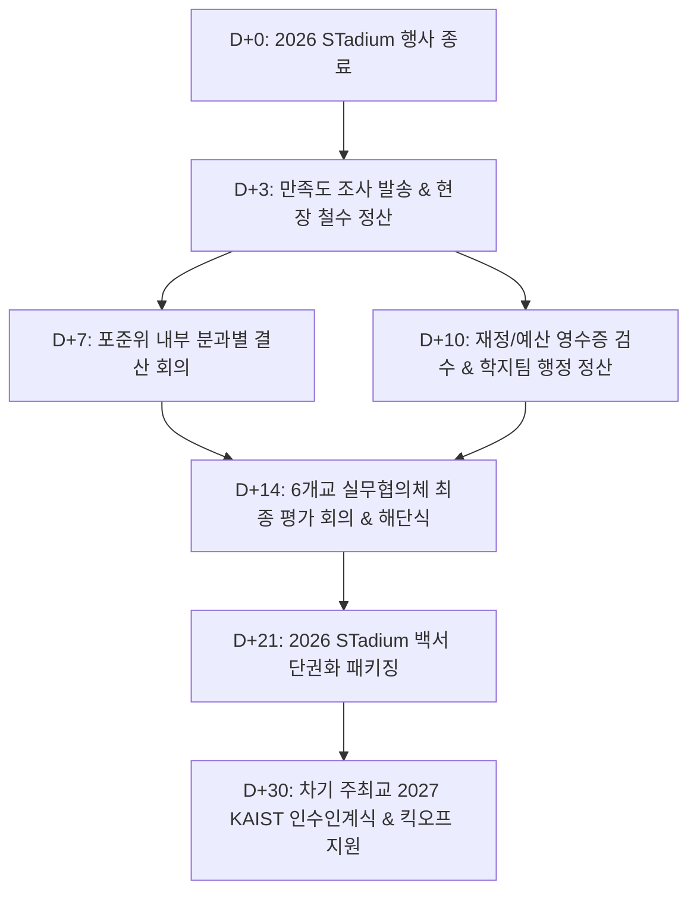

# IV. Evaluation & Handoff (2026 STadium 결산, 평가 및 차기 대회 인수인계)

---

## 1. 개요 및 목적 (Executive Overview & Objectives)

본 문서는 2026년 POSTECH에서 개최된 6개 이공계 특성화대학(KAIST, GIST, DGIST, UNIST, POSTECH, KENTECH) 연합 교류전 **2026 STadium**의 종료 후 **재정 결산, 성과 평가 및 차기 주최교(2027 KAIST)로의 종합 인수인계 체계**를 정의한 백서 세부 문서이다.

행사의 성공적인 완수뿐만 아니라, 집행 예산의 투명한 정산, 8대 이해관계자 피드백 수집을 통한 문제점 회고, 그리고 축적된 실무 노하우와 백서 패키지의 차기 주최교 이관을 통해 STadium 행사의 지속 가능성과 완성도를 지속적으로 향상시키는 것을 목적으로 한다.

---

## 2. 인수인계 및 결산 전체 워크플로우 (End-to-End Workflow)



---

## 3. 재정 결산 및 예산 정산 절차 (Financial Settlement & Administrative Audit)

### 3.1 총 예산 지출 및 수입 구조 결산

2026 STadium의 재정 결산은 **POSTECH 교비 지원금(학지팀 본회계)**, **주최교 학생회비/자치기금**, **타교 참가 분담금**, **동문 기업 후원금** 및 **푸드트럭/부스 입점 수수료**로 구성되며, 행사 종료 후 10일 이내에 영수증 증빙 및 이월금 정산을 완료한다.

| 예산 구분 | 수입/지출 항목 | 예상 금액 (원) | 정산 주체 및 증빙 방식 | 비고 |
|---|---|---|---|---|
| **교비 지원금 (학지팀)** | 무대/음향 대여, 경기장 대관, 구급차 렌탈, 선수단 도시락/생수, 기본 굿즈 등 | 22,750,000 | POSTECH 학지팀 (세금계산서, 법인카드 전표, 거래명세서) | 교비 집행 가능 지출 전용 |
| **주최교 자치기금** | TF 운영비, 심판진 다과, 비상 파스/핫팩, 자체 이벤트 경품 등 | 3,500,000 | 포준위 회계 담당 (승인 영수증 및 카드전표) | 포준위 자치 회계 처리 |
| **타교 참가 분담금** | 교비 지출 불가 항목 (농구 전문 심판비 1,000,000원 등 타교 분담) | 1,000,000 | 6개교 실무협의체 (각교 1/5 또는 1/6 분담 입금 전표) | 5개 참여교 정산 분담 |
| **동문 기업 후원금** | 뉴로메카, 머플, DLG 등 동문 기업 협찬금 | 4,000,000 | 포준위-후원사 (후원 기부금 영수증 및 후원 계약서) | 굿즈 고도화 및 쉼터 조성 |
| **부스/푸드트럭 수수료** | 푸드트럭 3종 및 렌탈 부스 전기/장소 입점비 | 600,000 | 포준위 회계 담당 (입금 확인서 및 입점 계약서) | 현장 운영 자치비 충당 |

### 3.2 비목별 정산 및 증빙 증서 관리 프로세스

1. **교비 지원금 정산 (POSTECH 학지팀)**
   - **제출 서류**: 사업자등록증 사본, 통장 사본, 전자세금계산서 또는 법인카드 전표, 거래명세서, 납품 완료 사진(무대, 굿즈, 도시락 등).
   - **기한**: 행사 종료 후 D+7까지 학지팀 제출 및 D+14까지 최종 행정 승인 완료.
2. **외주 용역업체 수의계약 정산**
   - 무대/음향 용역계약서 및 응급 구급차 렌탈 계약서상의 과업 완료 검수표 확인 후 대금 지불.
3. **타교 분담금 정산 (농구 심판비 등)**
   - 교비 지출 불가 판정을 받은 농구 전문 심판진 위촉비(100만 원)는 5개 참여교(KAIST, GIST, DGIST, UNIST, KENTECH) 대외협력국으로 정산 요청 공문 및 계좌 이금 확인서 발송하여 D+10까지 집행 완료.
4. **집행 잔액 및 이월금 처리**
   - 교비 지원금 잔액은 대학 본부 환수 처리.
   - 자치기금 및 후원금 집행 잔액은 차기 POSTECH STadium 준비위원회 이월기금으로 적립.

---

## 4. 이해관계자 종합 만족도 조사 및 피드백 분석 (Satisfaction Survey & Feedback)

### 4.1 4대 대상 그룹별 만족도 조사 설계

행사 종료 당일(D-Day) 저녁부터 D+5까지 Google Forms를 통해 4개 그룹별 맞춤형 설문 조사를 실시한다.

| 설문 대상 그룹 | 주요 조사 항목 및 평가 지표 | Target 응답률 |
|---|---|---|
| **종목 대표자 및 선수단** | - 경기장 시설/잔디 상태 및 안전성 만족도<br/>- 전문 심판진 판정의 공정성 및 룰 사전 안내 만족도<br/>- 경기 간 휴식 시간 및 음료/핫팩 지원 만족도 | 70% 이상 (약 200명) |
| **무대 공연 동아리** | - 무대/음향/조명 퀄리티 및 리허설 시간 보장 만족도<br/>- 댄스 플로어 매트 상태 및 백스테이지 대기실 환경<br/>- 큐시트 정시 준수율 및 스태프 소통 만족도 | 85% 이상 (26개 팀) |
| **일반 관람객 및 응원단** | - 푸드트럭 3종 및 체험 부스(LoL, 오락기) 만족도<br/>- 쉼터/체육관 실내 환경 및 쓰레기 수거 위생 만족도<br/>- 실시간 스코어 중계 및 SNS 경품 이벤트 만족도 | 40% 이상 (약 300명) |
| **포준위 & 6개교 TF 스태프** | - 실무협의체 소통 및 단권화 매뉴얼 명확성<br/>- 현장 비상 에스컬레이션 대응 속도 및 식사/휴식 환경<br/>- 업무 강도 및 분과별 업무 배정 적정성 | 90% 이상 (포준위 전체) |

### 4.2 2026 STadium 종합 성과 및 개선점 도출 구조 (KFS & Pitfalls)

- **핵심 성공 요인 (Key Success Factors)**:
  - 교내 도보 동선 집약(대운동장-체육관-콜로세움)으로 관람객 참여도 극대화.
  - 경기장 룰 사전 단권화 및 대한/지역 전문 심판진 배치로 판정 시비 Zero 달성.
  - 무대 큐시트 버퍼 시간(15분) 및 댄스 플로어 4면 테이핑 사전 검수로 무대 사고 방지.
- **주요 개선 필요점 (Major Pitfalls & Countermeasures)**:
  - 교외 야구 경기장(곡강 야구장) 셔틀버스 운행 시 경기 지연에 따른 셔틀 배차 간격 불균형 ➔ *차기 대회 시 셔틀 전용 핫라인 구축 필요*.
  - 주말 지곡회관/1학 식당 운영 시간 정체 현상 ➔ *푸드트럭 수량 확대 및 식사 쿠폰 시차 배부 필요*.

---

## 5. 결산 및 평가 회의 개회 (Post-Event Debriefing Meetings)

### 5.1 포준위 내부 종합 평가회 (D+7)

- **참석자**: 포준위 위원장, 부위원장, 분과장(매뉴얼, 디자인, 공연/부스, 종목) 및 전 스태프.
- **주요 안건**:
  1. 분과별 당일 운영 실적 및 큐시트 타임테이블 준수율 회고.
  2. 예산 지출 내역 1차 검수 및 영수증 누락건 확인.
  3. 현장 발생 우발 상황(부상자, 장비 고장, 타교 불만) 대응 평가.

### 5.2 6개교 실무협의체 최종 평가 회의 및 해단식 (D+14)

- **참석자**: 주최교(POSTECH) 대외협력국장(의장), 5개교 대외협력국장 및 각교 총학생회 관계자.
- **주요 안건**:
  1. 2026 STadium 종합 운영 경과 보고 및 만족도 조사 결과 발표.
  2. 타교 분담금 최종 정산 및 승인.
  3. 6개교 단권화 경기 규칙집 개정안 최종 확정.
  4. 2027 차기 주최교(KAIST) 선포 및 해단식 진행.

---

## 6. 차기 주최교(2027 KAIST) 종합 인수인계 패키지 (Master Handoff Package)

### 6.1 STadium 백서(Whitebook) 단권화 패키지 이관

2026 STadium 백서는 모든 운영 노하우를 모듈화하여 저장하며, 차기 주최교 인수인계 시 메인 파일과 5개 세부 서브 페이지 전체를 이관한다.

- 메인 백서: [Whitebook.md](file:///c:/Users/joon3/Downloads/STadium/Whitebook.md)
- Section 0 (조직 및 거버넌스): [Architecture.md](file:///c:/Users/joon3/Downloads/STadium/Architecture.md)
- Section I (구성원 니즈 분석): [Needs.md](file:///c:/Users/joon3/Downloads/STadium/Needs.md)
- Section II (운영 고려사항 및 리스크): [Considerations.md](file:///c:/Users/joon3/Downloads/STadium/Considerations.md)
- Section III (분과별 세부 실행 계획): [Implementation.md](file:///c:/Users/joon3/Downloads/STadium/Implementation.md)
- Section IV (결산 및 인수인계 체계): [Handoff.md](file:///c:/Users/joon3/Downloads/STadium/Handoff.md)

### 6.2 5대 핵심 인수인계 데이터베이스 (Master Archive DB)

차기 주최교 준비위원회가 즉시 활용할 수 있도록 구글 드라이브 및 GitHub 아카이브 형태로 전달하는 5대 핵심 DB는 다음과 같다.

```
[2026 STadium Master Archive DB]
├── 1. 종목별 규정집 & 룰북 DB ────────── 5개 종목(축구/농구/야구/배드민턴/LoL) 단권화 룰북 & 심판 서약서
├── 2. 외주 업체 & 심판진 DB ────────── 전문 심판진 위촉 인적사항, 무대/음향 업체, 구급차, 푸드트럭 섭외처
├── 3. 재정 예결산 & 정산 템플릿 DB ──── 교비 2,275만 원 집행 전표, 타교 분담금 요청 공문, 거래명세서 서식
├── 4. 안전 & 수송 매뉴얼 DB ──────────── 45인승 대절 버스 셔틀 동선, 사설 구급차 동선, 종합 비상연락망
└── 5. 디자인 & 홍보 원본 자산 DB ────── AI/PSD 로고 원본, 스포츠타올, 현수막, 카드뉴스 템플릿 파일
```

| 데이터베이스 구분 | 주요 포함 내용 | 이관 형식 |
|---|---|---|
| **1. 종목별 단권화 룰북 DB** | 축구, 농구, 야구, 배드민턴, e-스포츠(LoL) 종목별 규칙, 선수 명단 서식, 대진표 추첨 템플릿, 심판 서약서 | `.pdf`, `.docx` |
| **2. 전문 심판진 및 외주 DB** | 대한/지역 스포츠협회 연락처, 무대 음향/조명 견적서, 푸드트럭 섭외처, 사설 응급 구급차 렌탈 업체 DB | `.xlsx` |
| **3. 예결산 및 회계 서식 DB** | 가예산안(상한/하한), 학지팀 영수증 전표 서식, 타교 분담금 정산 공문 템플릿, 상품 수령 확인서 | `.xlsx`, `.pdf` |
| **4. 안전/수송/식사 매뉴얼 DB** | 대절 버스 주차 관리 지침, 구급차 3대 배치 동선, 도시락 배송 및 식당 이용 가이드, 비상연락망 | `.docx`, `.pdf` |
| **5. 디자인 원본 자산 DB** | STadium 공식 로고(AI vector), 카드뉴스 틀, 현수막/팜플렛 원안, 스포츠타올 및 슬로건 인쇄 파일 | `.ai`, `.psd`, `.png` |

---

## 7. 인수인계 실무 노하우 및 체크리스트 (Handoff Checklist)

### 7.1 역대 4개년(2022~2025) 데이터 기반 실무 팁 & 주의사항

1. **농구 심판비 사전 분담금 확정**:
   - 농구 전문 심판비(약 100만 원)는 교비 지출이 불가할 수 있으므로, 4월 1차 실무협의체 회의에서 5개 참여교 사전 분담(각 20만 원)을 문서로 확약받을 것.
2. **야구/PC방 교외 대관 사전 예치금 확보**:
   - 외부 경기장 대관 및 PC방 전체 대관은 최소 행사 3개월 전(7~8월) 예치금을 지급하고 대관 확약서를 수령할 것.
3. **무대 공연 댄스 플로어 사전 검수**:
   - 체육관 무대 바닥의 미끄러움으로 인한 부상을 방지하기 위해 댄스 플로어 매트 설치 후 4면 테이핑을 스태프가 직접 검수할 것.
4. **e-스포츠 계정 본인 인증 사전 검증**:
   - 대회 당일 타인 계정 도용 시비 방지를 위해 선수 등록 시 본인 명의 계정 증빙 제출을 의무화할 것.

### 7.2 차기 주최교(2027 KAIST) 타임라인별 인수인계 체크리스트

| 단계 | 추진 기한 | 인수인계 핵심 점검 항목 | 완료 여부 |
|---|---|---|---|
| **D+30** | **12월 초** | - 2026 STadium 종합 백서 패키지 전달 및 인수인계식 개최<br/>- 구글 드라이브 권한 이계 및 5대 아카이브 DB 전달 | [ ] |
| **D+60** | **1월 중** | - 2027 KAIST 준비위원회 킥오프 지원 및 전년도 위원장 1:1 멘토링<br/>- 학지팀 행정 정산 및 교비 지출 내역 최종 피드백 전달 | [ ] |
| **D+90** | **2월 말** | - 2027 STadium 1차 6개교 실무협의체 구성 가이드 전달<br/>- 단권화 경기 규칙집 차기 개정 안건 이관 | [ ] |

---

## 8. 맺음말 및 결언

2026 STadium은 POSTECH 준비위원회의 철저한 수송·안전·경기 운영과 6개교 실무협의체의 지속적인 협력을 통해 성공적으로 수행될 것이다. 본 **`Handoff.md`** 및 전체 백서 모듈([Whitebook.md](file:///c:/Users/joon3/Downloads/STadium/Whitebook.md))은 차기 2027년 KAIST 대회뿐만 아니라 향후 이공계 특성화대학 연합 교류전의 정통성과 운영 완성도를 지탱하는 견고한 토대가 될 것이다.
