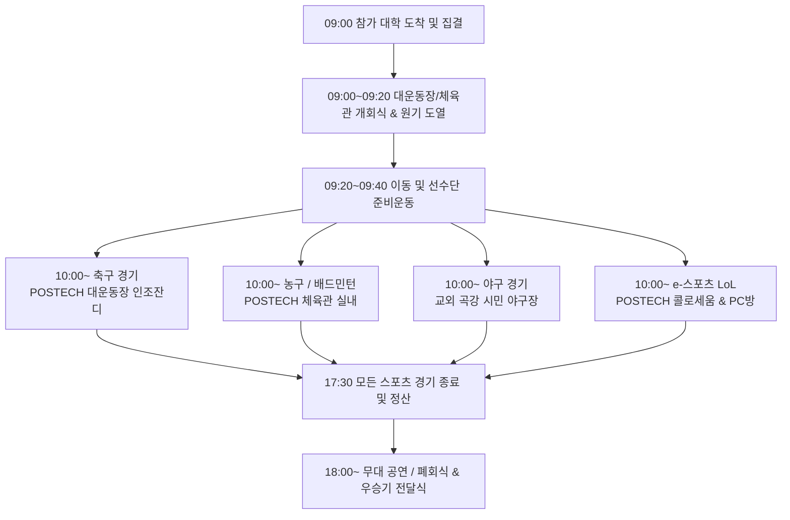

# III. Implementation (2026 STadium 분과별 세부 실행 및 운영 계획)

---

## 1. 개요 및 대상 구성원

### 1.1 문서 개요
본 문서는 2026년 POSTECH에서 개최되는 6개 이공계 특성화대학(KAIST, GIST, DGIST, UNIST, POSTECH, KENTECH) 연합 스포츠 및 문화 교류전 **2026 STadium**의 당일 및 사전 실무 운영 세부 계획을 수록한 백서 세부 실행 문서이다. 

본 실행 계획은 Past 4개년(2022~2025) 동안 축적된 현장 문제점(21개 항목)과 개선책을 반영하고, POSTECH 준비위원회(포준위) 4대 분과 TF(매뉴얼, 디자인, 공연/부스, 종목) 회의록, 학지팀 미팅 사업계획서, 가예산안, 종목별 단권화 규칙집 및 뒷정리/인력배치 매뉴얼에 엄격히 근거하여 수립되었다.

### 1.2 대상 구성원 및 분과별 핵심 역할

| 분과 구분 | 주체 및 담당자 | 주요 실무 실행 및 통제 과제 |
|---|---|---|
| **총괄 및 매뉴얼 TF** | **서영서 (총괄)**, 매뉴얼 TF 팀원 | 행사 종합 운영 타임라인 준수, 장소 대관 및 서약서 체결, 45인승 대절 버스 주차/수송망 통제, 뒷정리 예치금 및 장소 검수 관리. |
| **종목 TF (스포츠)** | **윤석영 (총괄)**, 축구(홍사준/홍준우), 야구(양광모/이현서), 농구(지환/유희진), 배드민턴(이희재/김태승), LoL(김태승/오상원) | 5개 종목 대진표 및 쿼터제 타임테이블 운용, 전문 심판진 위촉 및 대표자 사전 룰 미팅, 본인 명의 계정/신분 검증, 경기용품(공인구, 셔틀콕) 제공. |
| **공연 및 부스 TF** | **김태린 (무대 총괄)**, 박준혁 (대기실/공연순서), 서영서 (부스) | 체육관 실내 무대 셋팅 및 20kW 전력 용량 확보, 26개 동아리 큐시트 및 백스테이지 15분 버퍼 통제, 공연자 서약서 집행, 3종 푸드트럭 및 체험 부스 섭외. |
| **디자인 TF** | **이가원 (헤드쿼터)**, 김태린 (카뉴), 홍준우 (현수막), 윤석영 (팜플렛), 황석훈 (인스타), 이재린, 장영재 | 공식 로고 asset, 2026 스포츠타올, 슬로건, 종목별 병맛 현수막 4종, 800매 팜플렛 인쇄, 인스타그램 경품 카드뉴스 및 중계 템플릿 제작. |
| **예산 및 후원 팀** | 포준위 예산담당 및 대외협력팀 | 학지팀 배정 예산(2,275만 원) 집행 관리, 가예산 상한/하한 통제, 7개 동문 기업(포스텍홀딩스, 펜타세큐리티, DLG, 뉴로메카 등) 후원 유치 및 예우 이행. |
| **안전·수송 & 스태프** | 현장 인솔 및 보건 스태프 | 45인승 버스 16~20대 주차 동선 분리, 사설 구급차 3대 배치, 구급상자 지원, 주말 교내 식당 개방 및 지곡/오아시스 식사 질서 관리. |

---

## 2. 스포츠 경기 운영 계획 (Sports Competition Plan)



### 2.1 종합 타임테이블 및 대진 운영 원칙
1. **타임테이블 정시성**: 오전 9시까지 POSTECH 집결. 지각 발생 시 최대 30분 버퍼를 부여하되, 30분 초과 지각으로 인한 피해(예: 리허설 취소, 해당 경기 몰수패)는 해당 대학이 부담한다.
2. **사전 신분 확인**: 모든 경기 시작 40분 전 경기장 전담 스태프(2인 상주)에게 학생증/신분증 제출 및 본인 확인 검증을 받는다.
3. **전문 심판진 위촉**: 판정 시비를 차단하기 위해 대한/지역 체육회 소속 전문 심판진을 대거 위촉하며, 경기 시작 15분 전 `대표자-심판진 룰 미팅`을 의무 실시한다.

### 2.2 5개 종목별 세부 운영 규칙 및 인프라

#### ① 축구 (Football)
- **담당자**: 홍사준 (담당), 홍준우 (TF) | **장소**: POSTECH 대운동장 (인조잔디)
- **경기 방식**: 전/후반 각 25분 (하프타임 10분). 동점 시 연장전 없이 5인 승부차기 진행.
- **운영 물품 및 인력**: 공인구 제공, 볼보이 및 구급상자 사전 배치, 전문 심판진 2심제/3심제 운영.
- **안전 통제**: 경기장 주변 차량 주차 구역 인근에서 경기가 진행되므로 주차 차량 파손 방지 공지 및 안전펜스 설치.

#### ② 농구 (Basketball)
- **담당자**: 지환 (담당), 유희진 (TF) | **장소**: POSTECH 체육관 (실내 코트)
- **경기 방식**: 쿼터제(4쿼터, 쿼터당 8분). 1~3쿼터는 데드타임 1분, 4쿼터는 데드타임 2분 적용. 2~3쿼터 사이 하프타임 10분 부여.
- **공식구 및 협조**: FIBA 승인 Molten BG4500 공식구 사용. POSTECH 농구동아리(POBBA) 경기 기록 및 조교 지원.
- **수칙 고지**: 안경 착용자의 경우 스포츠 고글 착용 권장(사전 심판 미팅 공지), 샷클락 전원 릴선(15m) 사전 배선, 하프타임 바닥 정리 전담 스태프 배치.

#### ③ 야구 (Baseball)
- **담당자**: 양광모 (담당), 이현서 (TF) | **장소**: 교외 곡강 시민 야구장 (또는 포항 생체 야구장)
- **경기 방식**: 7이닝 또는 2시간 15분 시간제한 적용. 동점 시 승부치기(무사 1, 2루, 연속 타순) 진행.
- **수송 및 물품**: POSTECH ↔ 야구장 간 45인승 셔틀버스를 30분 간격 운행하며 버스 탑승 시 신분증 검사 실시. 경시구 공인구(경기당 8~10개) 및 배트 스프레이 제공. 더그아웃 페트병/도시락 쓰레기 봉투 사전 지급.

#### ④ 배드민턴 (Badminton)
- **담당자**: 이희재 (담당), 김태승 (TF) | **장소**: POSTECH 체육관 (배드민턴 실내 코트)
- **경기 방식**: 남복/여복/혼복/남단/여단 5개 세부 종목 (3승 선승제). 21점 3판 2선승 듀스 적용.
- **운영 물품**: 2만 원 후반대 지정 셔틀콕 사용, 점수판 6개 배치, 실내 바닥 미끄럼방지 용액 제공.
- **코트 통제**: 코트 비는 즉시 다음 경기를 진행하되, 선수 대기실 전광판 및 단톡방으로 정시 출발 타임라인 사전 고지.

#### ⑤ e-스포츠 (League of Legends)
- **담당자**: 김태승 (담당), 오상원 (TF) | **장소**: POSTECH 콜로세움 / 복합관 (결선 관람 중계) & 외부 PC방 (예선)
- **경기 방식**: 5:5 소환사의 협곡. Hard Fearless 밴픽(해당 세트 사용 챔피언 재사용 불가) 적용. 예선/3·4위전 단판, 결선 3판 2선승.
- **본인 검증**: 경기 20분 전 본인 명의 계정 확인. 타인 명의(가족 계정 등) 사용 시 가족관계증명서 모바일 캡처본 사전 제출 및 신분확인. 대리 플레이 적발 시 즉시 몰수패.
- **장비 & 통제**: 개인 키보드/마우스 허용(단, 매크로 및 외부 불법 프로그램 금지). 전체채팅(All Chat) 2회 이상 사용 시 경고 및 패배 처리.

---

## 3. 무대 공연 및 큐시트 계획 (Stage & Cultural Performance Plan)

### 3.1 무대 장소 및 전력 인프라 스펙
- **무대 위치**: **POSTECH 체육관 (실내 전용 무대)**
  - 11월 포항 해안가의 야간 한파 및 강풍 변수를 근본적으로 통제하기 위해 실내 체육관을 전용 무대로 확정.
- **음향/조명 외부 용역**: 전문 음향·조명 외주 용역업체 계약 (집행예정액 6,820,000원).
- **전력 용량 확보**: 무대 음향/조명 앰프 전용 메인 배전함으로부터 **최소 20kW 이상**의 산업용 연장 릴선 및 분전반 사전 현장점검 완료.

### 3.2 26개 동아리 공연 큐시트 타임테이블 (가안)

| 시간대 | 소요시간 | 구분 | 내용 및 세부 상세 | 통제 및 담당 스태프 |
|---|---|---|---|---|
| **13:00~13:40** | 40분 | 준비 | 무대 음향/조명 시스템 워밍업 및 최종 점검 | 무대 감독 & 음향 엔지니어 |
| **13:40~14:00** | 20분 | 악기 세팅 | 드럼, 앰프, 키보드 공용 악기 셋팅 및 마이크 테스트 | 백스테이지 담당 (김태린) |
| **14:00~15:20** | 80분 | 리허설 | 댄스(15분) ➔ CHEERO(15분) ➔ 힙합(10분) ➔ 밴드분과(40분) | 리허설 전담 스태프 |
| **15:25~15:30** | 5분 | 개막 | 사회자 오프닝 멘트 및 6개교 학생회장 개회사 | 사회자 & 포준위 위원장 |
| **15:30~16:04** | 34분 | 공연 1부 | **밴드 분과 1** (4개 팀 연주, 팀간 버퍼 30초~1분 준수) | 무대 인솔 스태프 (박준혁) |
| **16:05~16:30** | 25분 | 공연 2부 | **밴드 분과 2** (3개 팀 연주, 교대 버퍼 확보) | 백스테이지 통제 스태프 |
| **16:30~17:01** | 31분 | 공연 3부 | **VOCES 및 댄스/보컬 연합 무대** | 댄스 플로어 검수 스태프 |
| **17:01~17:15** | 14분 | 중간 이벤트 | 악기 철수, 경품 추첨 및 인터미션 | 이벤트 담당 스태프 |
| **17:15~20:00** | 165분 | 공연 4부 | 6개교 메인 무대 동아리 공연 및 클럽 나이트 (Club Night) | 무대 총괄 (김태린) |
| **20:00~20:20** | 20분 | 폐회식 | 2026 STadium 시상식, 우승기 전달 및 차기 주최교(KAIST) 선언 | 연석회의 및 포준위 전체 |

### 3.3 백스테이지 통제 및 공연자 서약서 집행

```
[백스테이지 통제 프로토콜]
1. 밴드 악기 스펙 동결 (D-21): 개인/공용 악기(드럼셋, 키보드, 기타 앰프) 스펙 사전 제출 및 동결.
2. 백스테이지 15분 버퍼: 밴드 동아리 교대 시 minimum 15분의 셋팅/튜닝 버퍼를 큐시트에 의무 반영.
3. 댄스 플로어 안전 검수: 댄스 동아리 무대 전, 미끄럼 방지 전용 매트 4면 테이핑 검수.
```

- **공연자 서약서 (1차~3차 서약서)**: 모든 무대 참가 동아리는 다음 항목에 대한 서약서를 제출한다.
  - 대기실 청결 및 비품 파손 금지 (파손 시 동아리 자부담 정산).
  - 지각으로 인한 공연 딜레이 발생 시 해당 동아리 공연 시간 즉시 차감.
  - 음주 상태의 무대 입상 금지 및 댄스 매트 오염 행위 엄금.

---

## 4. 부스 & 푸드트럭 운영 계획 (Booths & Food Trucks Plan)

### 4.1 부스 구역 및 공간 레이아웃
- **운영 장소**: **POSTECH 오룡관 앞 잔디밭 및 기계동 잔디 구역**
  - 관람객 도보 이동 동선 중심에 배치하여 관람객 접근성을 극대화함.

### 4.2 푸드트럭 3종 섭외 및 메뉴 구성

| 푸드트럭 구분 | 주요 판매 메뉴 | 운영 및 위생 관리 수칙 |
|---|---|---|
| **1. 닭강정차** | 바삭 닭강정, 수제 핫도그 | 조리 전용 전기 배선 연결 및 잔여 기름/음식물 쓰레기 자진 수거 통 구비. |
| **2. 분식차** | 떡볶이, 튀김, 순대, 어묵, 콜팝 | 대형 쓰레기 봉투(100L) 3개 상시 배치, 주말 점심/저녁 피크타임 결제 대기열 관리. |
| **3. 타코야끼차** | 수제 타코야끼, 회오리 감자 | 카드/계좌이체 단말기 유선망 확인, 주변 잔디밭 음식물 투기 방지 현수막 부착. |

### 4.3 체험형 스타팅(STARTING) 부스 구성

```
[오룡관 잔디밭 체험 부스 존]
├── LoL 아이템 상점 ─────── 게임 테마 굿즈, 포션 음료, 아이템 캡슐 가챠 뽑기
├── 야구 스피드건 부스 ───── 구속 측정, 피칭 스트라이크존 도전에 따른 경품 지급
├── 옛날 오락기 렌탈 존 ──── 비트앤덩크, 슈팅파워 오락기 렌탈을 통한 스트레스 해소
└── 헤드쿼터(HQ) 부스 ───── 인스타그램 인증샷 경품 추첨, 안내 책자 배부 및 응급약품 지원
```

1. **LoL 아이템 상점**: E-sports 경기 연계 테마 부스. 포션 음료(체력/마나 포션) 및 캡슐 가챠 뽑기 이벤트 진행.
2. **야구 스피드건 & 스트라이크존 부스**: 스피드건 구속 측정 및 스트라이크존 미니 게임을 통한 굿즈 배부.
3. **옛날 오락기 렌탈 존**: 비트앤덩크, 슈팅파워 오락기 렌탈을 통해 경기 대기 시간 동안 참가자들의 오락 공간 제공.
4. **인스타그램 인증샷 경품 부스**: STadium 공식 인스타그램 팔로우 및 부스/경기 인증샷 태그 시 경품(배달의민족, 베스킨라빈스 쿠폰 등) 추첨.

---

## 5. 디자인 & 굿즈 제작 계획 (Design & Goods Plan)

### 5.1 디자인 TF 조직 및 담당 업무
- **디자인 총괄**: 이가원 (헤드쿼터/슬로건)
- **세부 품목 담당**: 김태린 (카드뉴스), 홍준우 (현수막), 윤석영 (팜플렛), 황석훈 (인스타그램 assets), 이재린, 장영재.

### 5.2 주요 디자인 Asset 및 굿즈 제작 명세

```
[2026 STadium 디자인 Asset 패키지]
├── 공식 로고 asset ─────── logo.ai, logo_black.png, logo_color.png, logo_white.png
├── 굿즈 디자인 ────────── 25_포준위_스포츠타올.ai (2026 공식 스포츠 타올)
├── 메인 슬로건 ────────── 슬로건.ai (6개교 연합 및 스포츠 정신 슬로건)
├── 현수막 4종 ────────── 축구, 야구, 농구/배드민턴, 포스텍 응원용 현수막
└── 인쇄물 및 홍보 ──────── 팜플렛 800매 (365,500원), 인스타그램 카드뉴스 틀 (.png)
```

1. **공식 로고 (Official Logo)**: 2026 STadium 정체성을 담은 로고 Vector asset(AI, PNG) 확정 및 후원사 로고 배치 템플릿 적용.
2. **2026 공식 스포츠타올**: 6개교 참가 선수단 및 스태프 전원 배부용 고품질 응원 타올 제작 (`25_포준위_스포츠타올.ai`).
3. **슬로건 및 현수막 4종**:
   - 경기장별 응원 분위기 고취를 위한 종목별 병맛/재미+격식 혼합 현수막 디자인.
   - 대운동장, 체육관, 오룡관 부스 존, 교외 야구장에 각각 게치.
4. **800매 팜플렛 인쇄 (집행예정액: 365,500원)**:
   - 8면 접지 형태: 행사 인사말, 5개 종목 타임테이블, 캠퍼스 지도 및 부스 안내, 동문 후원사 광고 1면 수록.
5. **인스타그램 카드뉴스 및 홍보 Frame**:
   - 카드뉴스 틀(.png) 제작 완료. 경기 결과 실시간 발표, 경품 이벤트, 대절 버스 탑승 안내 카드뉴스 세트 구성.

---

## 6. 예산 & 후원 유치 계획 (Budget & Sponsorship Plan)

### 6.1 배정 예산 및 가예산 편성 구조 (상한 / 하한)

- **학지팀 공식 배정 예산**: **22,753,130원 (약 2,275만 원)**
- **가예산 상한 (Upper Limit)**: **28,424,690원** (모든 부대시설 및 대관 풀 스펙 포함)
- **최종 조정 집행예정액**: **22,587,939원** (감축 가능 예산 7,311,151원 절감 반영)

| 구분 | 세부 항목 | 집행예정액(원) | 감축 가능 예산(원) | 최종 집행예산(원) | 비고 및 비고 내역 |
|---|---|---|---|---|---|
| **스포츠** | 농구 심판비 | 900,000 | 0 | 2,000,000 | 포카전 기준 전문 심판진 3인 |
| | 축구 심판비 | 750,000 | 0 | 750,000 | 전문 심판진 3심제 |
| | 야구 심판비 | 320,000 | 0 | 506,500 | 전문 심판진 및 구장 매뉴얼 |
| | 종목 상패 제작 | 350,000 | 0 | 448,000 | 5개 종목 우승/준우승 상패 7개 |
| | E-sports 대여 | 175,000 | 0 | 300,000 | 콜로세움 유선 랜배선 및 PC방 |
| **공연 무대** | 무대 외부 용역 | 12,921,130 | 6,101,130 | 6,820,000 | 음향/조명 전문 외주 업체 계약 |
| **물품/운영** | 물품/상품 구매 | 5,833,140 | 1,210,000 | 4,623,140 | 음료(게토레이/파워에이드), 응급약 |
| | 사업관리/식사 | 1,500,000 | 0 | 1,185,100 | 회의비 및 스태프 식사 |
| | 팜플렛 제작 | 299,200 | 0 | 365,500 | 800매 8면 접지 인쇄 |
| | 부스 운영비 | 2,258,720 | 0 | 2,258,720 | 푸드트럭 3종, 오락기 렌탈, 굿즈 |
| | 운영물품 대여 | 2,282,500 | 21 | 2,284,479 | 광주렌탈 천막/의자/탁자 렌탈 |
| **합계** | **종합 총액** | **28,424,690** | **7,311,151** | **22,587,939** | **학지팀 배정 예산 범위 내 완수** |

### 6.2 동문 기업 후원 유치 및 예우 체계

```
[동문 기업 후원 유치 메일 발송 대상 (7개사)]
1. 포스텍 홀딩스 (POSTECH Holdings)
2. 펜타세큐리티 (Penta Security)
3. 넥스테리얼즈 (NEXTERIALS)
4. 라브라도랩스 (LABRADOR LABS)
5. 특허법인 영비 (Youngbee IP)
6. 법무법인 DLG (DLG Law)
7. 머플 (murple) & 뉴로메카 (Neuromeka)
```

- **후원 예우 티어 및 세부 단가표**:

| 후원 금액 | 주요 예우 항목 |
|---|---|
| **100만 원** | 현수막 내 후원사 로고 삽입, 인스타그램 스토리 업로드 및 하이라이트 추가. |
| **200만 원** | 100만 원 예우 + 인스타그램 경기결과 카드뉴스 하단 로고 노출. |
| **250만 원** | 200만 원 예우 + 기업홍보 카드뉴스 발행 & 학생회관/커뮤니티 라운지 홍보 부스 제공. |
| **300만 원** | 250만 원 예우 + 문화공연 무대 메인 배경에 후원사 대형 로고 노출. |
| **500만 원** | 300만 원 예우 + 경기 중계방송 하단 로고 노출, 중계 전후 광고 송출, 개회사 1분 홍보 발언. |
| **1,000만 원** | **최고 등급 예우**: 8면 팜플렛 중 1면 독점 광고, 개회사 3분 발언, 전 기념품(타올, 키링) 로고 삽입. |

---

## 7. 수송, 식사 & 안전·환경 관리 계획 (Transport, Meal, Safety & Venue Cleanup)

### 7.1 수송망 및 대절 버스 셔틀 관리
1. **타 대학 대절 버스 통제 (16~20대)**:
   - KAIST, GIST, DGIST, UNIST, KENTECH 5개교에서 도착하는 45인승 대형버스 16~20대의 하차/주차/상차 동선을 물리적으로 분리.
   - **하차 구역**: POSTECH 정문 및 대강당 앞 전용 하차장.
   - **장기 주차 구역**: POSTECH 대강당 뒤편 주차장 및 대운동장 외곽 주차장.
   - **주차 요원 배치**: 구역별 스태프 2인 이상 전담 배치 및 안전 라인 꼬깔(Cone) 사전 설치.
2. **교외 경기장 셔틀버스**:
   - POSTECH ↔ 교외 야구장(곡강 시민 야구장) 간 45인승 셔틀버스를 30분 간격으로 운행.

### 7.2 식사 인프라 및 뒷정리 예치금 매뉴얼

```
[주말 식사 수용 및 공간 개방]
├── POSTECH 지곡회관 / 학생식당 1층 전체 개방 ── 참가자 식사 및 실내 쉼터 활용
├── 지곡 먹튀/쓰레기 방지 스태프 (3명 상주) ────── 음식물 쓰레기 방지 및 정돈
└── 학관 오아시스 점심식사 스태프 (6명 상주) ───── 외부 단체 도시락 지정 배송 관리
```

1. **주말 식당 휴무 대응**: 교내 지곡회관/학생식당 1층 전체를 참가자 전용 식사 쉼터로 일괄 개방하고, 외부 단체 도시락(본도시락 등) 공동구매 배송 수송망을 운용.
2. **장소 예치금 및 서약서 관리**:
   - **예치금 제도**: 장소를 배정받는 각 대학에 사전 예치금을 수령하고 `장소 사용 서약서`를 집행함.
   - **사전 현장 사진 촬영**: 행사 시작 전 스태프가 해당 공간의 상태(바닥, 책상, 프로젝터, 기존 흠집)를 구석구석 촬영하여 공유.
   - **검사 및 반환**: 행사 종료 후 담당 스태프가 기물 파손, 쓰레기 수거, 청결도를 검사한 후 이체 내역 캡처본과 함께 현장에서 100% 반환 (노쇼 또는 검사 미이행 시 반환 불가, 파손 발생 시 복구비 공제).
   - **쓰레기 봉투 지급**: 각 대학별 100L 쓰레기 봉투 N부를 사전 지급하고 수거 장소 지정 부착.

### 7.3 안전, 의료 및 기상·위생 대책
1. **응급 구급차 3대 배치**: 사설 응급 구급차 3대를 축구장(대운동장), 야구장(곡강 야구장), 체육관에 각각 풀타임 배치.
2. **응급처치 구급상자 완비**: 파스, 소독약, 거즈, 테이핑 테이프, 체온계 등 구급상자 및 전 참가자 대상 여행자보험 통합 가입.
3. **방한 및 온열용품 확보**: 11월 야외 경기장 한파에 대비하여 참가자 및 관람객 1인당 핫팩 2~3개(총 1,500개 이상)를 사전 구매하여 현장 공급.

---

## 8. 링킹 및 하위 서브 페이지 아키텍처

- 백서 마스터 인덱스: [Whitebook.md](file:///c:/Users/joon3/Downloads/STadium/Whitebook.md)
- Section 0: [Architecture.md](file:///c:/Users/joon3/Downloads/STadium/Architecture.md)
- Section I: [Needs.md](file:///c:/Users/joon3/Downloads/STadium/Needs.md)
- Section II: [Considerations.md](file:///c:/Users/joon3/Downloads/STadium/Considerations.md)
- Section III: [Implementation.md](file:///c:/Users/joon3/Downloads/STadium/Implementation.md) (본 문서)
- Section IV: [Handoff.md](file:///c:/Users/joon3/Downloads/STadium/Handoff.md)
