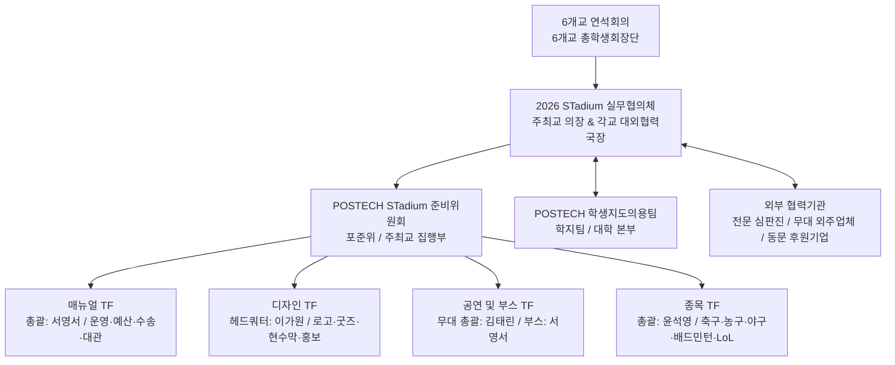
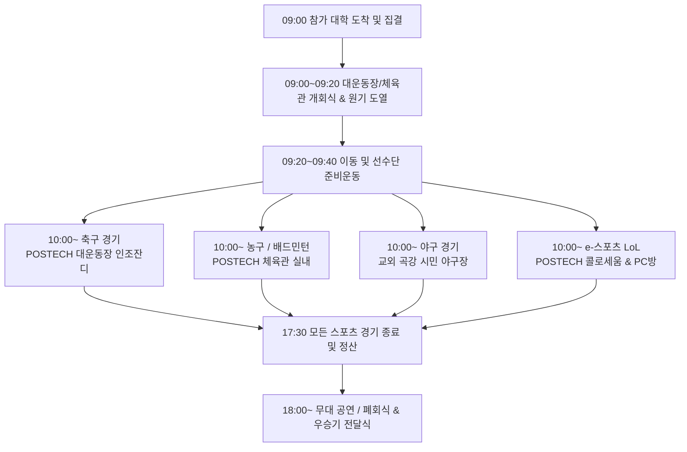

# 2026 STadium 종합 백서 (Whitebook Master)

**화이트북(Whitebook, 백서)**은 **2026 STadium(POSTECH 개최)**의 종합 정체성, 이해관계자 아키텍처, 구성원별 니즈, 4개년 문제점 기반 리스크 통제 방안, 분과별 세부 실행 계획 및 결산/인수인계 프로세스를 완벽히 수록한 단권화 종합 지침서입니다.

---

## 0. Executive Overview & Architecture (행사 아키텍처 및 조직 체계)

### 0.1 개요 및 행사의 정체성
본 문서는 2026년 POSTECH에서 개최되는 6개 이공계 특성화대학(KAIST, GIST, DGIST, UNIST, POSTECH, KENTECH) 연합 스포츠 및 문화 교류전 **2026 STadium**의 조직 거버넌스, 이해관계자 역할, 의사결정 체계, 공간 인프라 아키텍처 및 소통 프로토콜을 정의한다.

### 0.2 조직 구조 및 이해관계자 (Organizational Hierarchy & Stakeholders)



#### 핵심 이해관계자 구성원 및 역할

| 구성원 구분 | 주체 및 조직 | 주요 역할 및 담당 업무 |
|---|---|---|
| **최고 의결 기구** | **STadium 6개교 연석회의** | KAIST, GIST, DGIST, UNIST, POSTECH, KENTECH 6개교 총학생회장단. 대회 개최 일정, 주최교 선정, 교비 지출 불가 예산 분담 및 행정 공문 공동 대응 의결. |
| **실무 총괄 기구** | **2026 STadium 실무협의체** | 주최교(POSTECH) 대외협력국장(의장) 및 6개교 대외협력국장/동연회장. 정기 화상 회의(1차~8차), 대진표 추첨, 단권화 규정집 승인 및 종합 인수인계. |
| **주최교 집행 기구** | **POSTECH 준비위원회 (포준위)** | POSTECH 총학생회 중앙집행위원회 및 STadium 특임위원회. 행사 현장 총괄 및 분과별 TF(매뉴얼, 디자인, 공연/부스, 종목) 진두지휘. |
| **- 매뉴얼 TF** | 포준위 매뉴얼 분과 (서영서 총괄) | 종합 운영 타임라인 수립, 가예산 편성(상한/하한), 외부 장소 대관 및 예치금 계약, 타 대학 대절버스 주차 수송망 관리. |
| **- 디자인 TF** | 포준위 디자인 분과 (이가원 헤드쿼터) | 2026 STadium 공식 로고, 스포츠타올, 슬로건, 인스타그램 카드뉴스 틀, 현수막 및 팜플렛 디자인 제작 (김태린, 홍준우, 윤석영, 황석훈, 이재린, 장영재). |
| **- 공연 및 부스 TF** | 포준위 공연/부스 분과 (김태린 무대총괄) | E1/체육관 무대 큐시트 작성, 외부 음향/조명 업체 계약, 공연자 서약서 집행, 부스 및 푸드트럭(닭강정, 분식, 타코야끼 3종) 섭외 (박준혁, 서영서). |
| **- 종목 TF** | 포준위 종목 분과 (윤석영 총괄) | 축구(홍사준/홍준우), 농구(지환/유희진), 야구(양광모/이현서), 배드민턴(이희재/김태승), e-스포츠 LoL(김태승/오상원) 담당 지정, 규칙 단권화 및 심판진 위촉. |
| **대학 본부 지원** | **POSTECH 학생지도의용팀 (학지팀)** | 행정 예산 배정(공식 22,753,130원), 교내 시설(대운동장, 체육관, 콜로세움) 사용 승인 및 안전/보건 행정 지원. |
| **외부 협력 기구** | **전문 심판진 & 외주 용역업체** | 축구/농구/야구/배드민턴 대한·지역 스포츠협회 전문 심판진 위촉, 무대 전문 음향·조명 업체, 동문 기업 후원사(포스텍홀딩스, 펜타세큐리티, DLG, 뉴로메카 등). |

### 0.3 의사결정 체계 및 소통 프로토콜 (Decision-Making & Communication)
1. **상면 의결 단계 (Top-Level Hierarchy)**: 연석회의에서 국가적 비상 이슈, 교비 지출 불가 항목(농구 심판비 등) 타교 분담, 주최교 변경 등 중대 안건 의결.
2. **실무 협의 단계 (Operational Hierarchy)**: 실무협의체 정기 회의를 통해 매월 정기 화상 회의를 개회하여 종목별 엔트리 기한(행사 10일 전), 무대 타임테이블, 주차 동선 등을 협의.
3. **종목 및 공연 현장 단계 (Execution Hierarchy)**: 종목별 카카오톡 대표자 단톡방 구축 및 경기 직전 '대표자-심판진 룰 미팅' 의무화. 무대 백스테이지 통제방 운영.
4. **현장 비상 에스컬레이션 (Incident Escalation)**: 현장 시비 발생 시 `스태프 ➔ 종목 담당자 ➔ 포준위 위원장 ➔ 실무협의체 긴급 연석회의` 순으로 15분 이내 중재 처리.

### 0.4 공간 및 인프라 아키텍처 (Venue Architecture)

```
[POSTECH 메인 캠퍼스 (도보 5~10분 거리 집약)]
├── POSTECH 대운동장 ─────── 축구 경기 (인조잔디, 야외 관람) & 개회식 도열
├── POSTECH 체육관 ───────── 농구 / 배드민턴 경기 (실내 전천후) & 무대 공연 / 폐회식
├── POSTECH 콜로세움/복합관 ── e-스포츠 (LoL 예선/본선/결선 및 관람 중계)
└── 오룡관 앞 / 기계동 잔디 ── 부스 존 & 푸드트럭 3종 (닭강정, 분식, 타코야끼)

[교외 대관 시설]
└── 곡강 시민 야구장 ──────── 야구 경기 (예비: 포항 생체 야구장 / 45인승 셔틀 버스 수송망 연결)
```

### 0.5 추진 타임라인 및 마일스톤 (Timeline & Milestones)

| 추진 시기 | 주요 마일스톤 | 핵심 세부 과제 |
|---|---|---|
| **3월** | **TF 구성 및 1차 기획** | 포준위 TF 구성(매뉴얼, 디자인, 공연/부스, 종목), 1~3차 TF 회의 개회, 장소 및 가예산안(상한/하한) 수립. |
| **4월** | **실무협의체 발족 및 룰 작성** | 학지팀 미팅, 각 종목별 세부 규칙 초안 작성(~4/1), 운동 동아리 미팅(4/20~4/26), 6개교 실무협의체 1차 회의. |
| **5월~8월** | **디자인·대관·후원 확정** | 공식 로고/굿즈 디자인 확정, 외부 야구장 및 PC방 대관 검증, 동문 기업 후원 유치 메일 발송, 푸드트럭 섭외. |
| **9월~10월** | **엔트리·큐시트 확정** | 각교 대표선발전 진행, 엔트리 명단 확정(행사 10일 전), 무대 서약서 수령 및 큐시트 픽스, 인력배치 매뉴얼 최종 검수. |
| **11월 (D-Day)** | **행사 개최 및 인수인계** | 2026 STadium 1일 단일통합 행사 개최 ➔ 결산 회의 및 2027 차기 주최교(KAIST) 종합 인수인계. |

---

## I. Needs Analysis (구성원별 니즈 및 요구사항 분석)

### 1.1 8대 이해관계자 니즈 종합 매트릭스 (Needs Matrix Summary)

| 구분 | 이해관계자 그룹 | 핵심 요구사항 (Core Needs) | 주요 페인 포인트 (Pain Points) | 딜라이트 요소 (Delight Factors) |
|---|---|---|---|---|
| **1** | **주최교 포준위 / TF** | 예산(배정 2,275만 원) 내 안전 개최, 정시 타임테이블 준수, 차기 주최교 인수인계 체계 구축 | 교비 지출 행정 제한, 기상 변수(강풍/한파), 타임테이블 딜레이 파행 | 무사고 Zero, 6개교 종합 만족도 최상, 깔끔한 백서 수립 |
| **2** | **6개교 실무협의체** | 투명한 정보 공유(규정집, 동선, 큐시트), 공평한 지원, 6개교 단합 연출 | 사전 고지 없는 룰 변경, 타교 수송/주차 불이익, 소통 지연 | 엔트리/비상 안건 즉각 대응, 6개교 원기 행진 성공 |
| **3** | **종목 대표자 / 선수단** | 공정한 판정(전문 심판), 경기 간 충분한 휴식, 핫팩/의무물품 지원 | 심판 매뉴얼 미준수, 미끄러운 바닥, 경기 간 연속 배치 피로 | 1인당 핫팩 2~3개 (총 2,500개), 공인구/음료 지원, 전용 휴식 쉼터 |
| **4** | **무대 공연 동아리** | 안전한 댄스 플로어, 백스테이지 버퍼(15분), 악기 튜닝 & 대기실 보관 | 타이트한 셋팅시간, 장비 결함으로 인한 공연 취소 | 고화질 공연 레코딩, 모니터 스피커 최적 튜닝 |
| **5** | **관람객 & 서포터즈** | 푸드트럭 3종, 실내 휴식 쉼터, e-스포츠/스코어 중계 및 SNS 경품 | 경기장-무대 동선 분산, 추위 노출, 야외 식사 장소 부재 | LoL 아이템 상점, 옛날 오락기 렌탈, 굿즈/상품권 당첨 |
| **6** | **외부 전문 심판진** | 사전 단권화 규정집 승인, 경기 전 룰 미팅 의무화, 적정 심판비 지급 | 현장 항의 및 매뉴얼 차이, 대기 공간 부족, 정산 지연 | 선수단의 매너 플레이, 정시 경기 시작, 편안한 대기실 |
| **7** | **외주 업체 & 후원사** | 무대 전력 용량(20kW 이상) 사전 확보, 정시 큐시트, 브랜딩 노출 | 전력 셧다운, 현장 세팅 변경, 영수증/홍보 누락 | 포준위 현장 밀착 지원, 브랜딩 스폰서십 효과 극대화 |
| **8** | **대학 본부 (학지팀/시설팀)** | 학업 차질 최소화(1일 단일 행사), 안전사고 Zero, 투명한 예산 집행 | 교내 시설 파손, 쓰레기 방치 민원, 교비 불법 집행 | 단 1건의 사고 없는 완수, 언론 및 교내 우수 평가 |

### 1.2 종목별 세부 니즈 명세
- **축구**: 인조잔디 상태 점검 및 안전 라인 마킹, KFA 전문 심판진 3심제 공정 판정, 쿼터 간 휴식(최소 10분), 의무 물품(파스, 붕대, 테이핑) 현장 비치.
- **농구**: 체육관 마룻바닥 미끄럼 방지 청소, 샷클락 전원용 15m 릴선 사전 배선, 경기 사이 20분 이상 휴식, 안경 착용 불가/보호대 룰 사전 공지 및 대표자-심판진 사전 룰 미팅.
- **야구**: 정규 규격을 갖춘 곡강 시민 야구장 대관, 전광판 스코어보드 작동 여부 확인, 경기당 공인구 8~10개, 배트 스프레이, 45인승 셔틀버스 정시 운행.
- **배드민턴**: 2만 원 후반대 최고급 셔틀콕 공급, 점수판 6개 사전 배치, 미끄럼 방지 용액 제공, 정시 타임테이블 고지 프로세스.
- **e-스포츠 (LoL)**: 가족 명의 계정 사용 시 사전 제출 서류(가족관계증명서) 명확 고지, 유선 LAN 핑 딜레이 차단, 여분 키보드/마우스 비치.

### 1.3 상충 니즈 조율 및 에스컬레이션 전략
행사 준비 과정에서 발생하는 이해관계자 간 상충 니즈는 다음 규칙에 따라 조율한다.
```
[니즈 상충 발생] ➔ [우선순위 원칙 적용] ➔ [15분 이내 현장 중재] ➔ [실무협의체 최종 승인]
```
1. **선수단 휴식 요구 vs 타임테이블 정시성**: 경기 간 휴식시간을 최소 15~20분으로 표준화하되, 조기 종료 시 버퍼 시간을 휴식으로 제공.
2. **밴드 동아리 리허설 확대 vs 무대 공연 타임테이블**: 악기 스펙을 행사 3주 전 사전 동결하고, 백스테이지 버퍼시간(15분)을 활용하여 본 무대 직전 퀵 튜닝 실시.
3. **교비 집행 불가 항목 (농구 심판비 100만 원 등) vs 전문 심판 위촉 니즈**: 6개교 실무협의체 안건 상정을 통해 타교 지원금 및 학생회비 분담 협약 사전에 체결.

---

## II. Operational Considerations & Risk Mitigation (운영 고려사항 및 리스크 대책)

### 2.1 7대 핵심 분야별 리스크 대응 매뉴얼 & 체크리스트

#### 1) 행정 · 대외협력 & 소통
- **비상 공문 대응**: 국가적 비상 이슈나 본부 제재 발생 시, 6개교 연석회의를 1시간 이내 즉시 개회하여 공동 입장 공문 채택.
- **교비 지출 불가 예산 사전 타결**: 농구 심판비(100만 원) 등 교비 집행 불가 항목을 D-60에 분류하고 6개교 실무협의체 분담 협약 체결.
- **소통 채널 단권화**: 포준위 위원장, TF 팀장, 종목 담당자 핫라인 구축 및 D-14 대표자 단톡방 개설 완료.

#### 2) 경기 규칙 · 판정 & 전문 심판진
- **통합 경기 규정집 사전 확정**: 5개 종목 규정을 단권화하고, D-30 6개교 실무협의체 최종 승인 후 공표.
- **전문 심판진 서면 계약 및 룰 미팅**: 서면 계약 시 규정 준수 의무 명기, 경기 시작 30분 전 대표자-심판진 룰 미팅 의무화.
- **e-스포츠 본인 명의 계정 검증**: D-7까지 모바일 증빙 서류 제출받아 현장 스태프가 1:1 대조.

#### 3) 무대 기획 · 공연 & 타임테이블
- **체육관 실내 무대 확정**: 11월 야간 강풍/한파 차단을 위해 POSTECH 체육관 실내 무대를 Plan A로 확정.
- **백스테이지 셋팅 버퍼 15분 의무 반영**: 팀 간 minimum 15분 버퍼 배치.
- **악기 스펙 사전 동결**: D-21 26개 참여 동아리 악기 스펙 동결 후 외주 감독 전달.

#### 4) 공간 동선 · 배치 & 중계
- **캠퍼스 내 도보 동선 집약**: 대운동장-체육관-콜로세움-지곡회관을 도보 5~10분 이내 구역으로 집약.
- **e-스포츠 이원화 중계**: 콜로세움 내 유선 LAN망 확보 및 관관 중계 시스템 운영.
- **교외 야구장 셔틀 운행**: POSTECH ↔ 곡강 야구장 간 45인승 셔틀 버스(30분 간격) 배치.

#### 5) 시설 · 인프라 · 전력 & 부대 대관
- **전력 용량 점검**: 메인 무대 전력 용량(최소 20kW 이상) 사전 점검 및 배전반 작업 완료.
- **교외 야구장 부대시설 검증**: 곡강 야구장 전광판 작동, 통신망, 샤워실 온수 사전 확인 및 필요시 전광판 렌탈.
- **샤워실 온수 연장**: POSTECH 체육관 샤워실 온수를 행사 당일 22:00까지 연장 공급(시설팀 공문 완료).

#### 6) 식사 · 편의 & 수송 인프라
- **주말 식당 전체 개방**: 지곡회관/학생식당 1층 전체를 개방하고 단체 도시락(본도시락 등) 배송 수송망 수립.
- **대절 버스 주차 통제**: 타 대학 대절 버스 16~20대의 하차장(대강당 앞), 주차장, 퇴장 동선 분리.

#### 7) 안전 · 위생 · 기상 & 방한
- **사설 응급 구급차 3대 풀타임 운용**: 대운동장, 체육관, 곡강 야구장에 풀타임 배치.
- **방한 물품 확보**: 전 참가자/관람객 대상 핫팩 총 2,500개(1인당 2~3개) 및 무릎담요 사전 확보.
- **쓰레기 보증금제**: 학교당 10만 원 청소 보증금 예치 및 100L 쓰레기 봉투 수거 확인 후 반환.

### 2.2 과거 4개년(2022~2025) 21개 발생 문제점 전수 대응 마트릭스

| 연도 | 과거 발생 문제 (Problem) | 2026 POSTECH 개최 사전 통제 대책 (Mitigation) | 책임 주체 및 검수 타임라인 |
|---|---|---|---|
| 2022 | 이태원 참사 국가 애도기간 본부 행사 취소 통보 | 비상 상황 발생 시 6개교 연석회의 1시간 이내 개회 프로토콜 정립 및 긴급 대응. | 6개교 총학생회장단 / D-30 |
| 2023 | 농구 전문 심판비 교비 지출 불가 문제 | D-60 교비 지출 불가 항목 분류 완료 및 6개교 실무협의체 분담 협약서 사전 체결. | 실무협의체 의장 / D-60 |
| 2024 | e-스포츠 종목 대표자 단톡방 개설 지연 | e-스포츠 담당자(김태승) 지정, 단톡방 개설 마일스톤(D-14) 미준수 시 위원장 개입 통제. | e-스포츠 담당자 / D-14 |
| 2025 | 신생 학교(KENTECH) 원기 미제작 문제 | D-30 원기 및 깃발 현물 점검, 미제작 시 주최교(POSTECH)에서 규격 팻말 선제 제작. | 매뉴얼 TF / D-30 |
| 2022 | 경기 판정 시비 및 규칙 해석 차이 | 통합 경기 규정집 단권화 및 경기 시작 30분 전 대표자-심판진 룰 미팅 의무화. | 종목 TF 팀장 / D-30 |
| 2023 | 경기 매뉴얼 일부 종목 규칙 모호성 | 데드타임, 연장전, 교체 인원, 비디오 판정 여부 예외 조항 규정집 완전 명기. | 종목별 담당자 / D-21 |
| 2024 | 야구 경기 심판 매뉴얼 미준수 논란 | 외부 심판 위촉 시 규정집 준수 의무를 서면 계약서에 포함하고 경기 전 룰 점검. | 야구 담당자(양광모) / D-14 |
| 2025 | e-스포츠(LoL) 본인 명의 계정 미보유 | D-7 참가자 계정 사전 제출 및 예외 계정 시 모바일 증빙 검수, 경기전 1:1 대조. | e-스포츠 담당자 / D-7 |
| 2022 | 포스텍 밴드 동아리 중도 공연 포기 | 동아리 여건 조사, 팀당 백스테이지 셋팅 버퍼 15분 반영, 시험기간 중복 피하여 확정. | 공연/부스 TF / D-30 |
| 2023 | 무대 리허설 딜레이 발생 (30분 지연) | 26개 동아리 악기 목록 D-21 동결, 공용 악기 작동 상태 D-3 점검, 버퍼 15분 확보. | 공연/부스 TF / D-21 |
| 2024 | 무대 리허설 및 공연 시간 딜레이 | 외주 음향/조명 감독 브리핑, 밴드 장비를 전반부에 몰아서 배치하여 악기 교체 최소화. | 공연/부스 TF / D-14 |
| 2022 | 야구장 홈런 및 인프라 라인 판정 모호성 | 정규 규격을 갖춘 교외 전문 야구장(곡강 시민 야구장) 대관으로 모호성 근본 차단. | 종목 TF (야구) / D-45 |
| 2022 | e-스포츠(LoL) 관람 및 중계 공간 제약 | POSTECH 콜로세움/복합관을 중계 메인 관람석으로 지정, 대형 전광판 중계 가동. | e-스포츠 담당자 / D-14 |
| 2024 | 경기장과 공연장 분리에 따른 집중도 저하 | POSTECH 본원 내 도보 5~10분 거리에 축구-농구-배드민턴-무대-부스 집약 배치. | 매뉴얼 TF / 디자인 TF / D-30 |
| 2023 | 농구 경기 시 샷클락 전원 및 안경 착용 문제 | 종목별 장비 체크리스트(샷클락, 릴선 15m+) 사전 작성 및 스포츠 고글 룰 공지. | 농구 담당자(홍준우) / D-14 |
| 2025 | 잔디밭 개회식 전력 및 플랜카드 고정 불가 | 개회식을 POSTECH 대운동장/체육관으로 확정, 무대 주변 배전반 전력(20kW+) 점검. | 공연/부스 TF / D-21 |
| 2025 | 외부 야구장 전광판 및 통신 네트워크 부재 | 교외 야구장 전광판 작동 및 통신망 사전 검증, 미비 시 D-14 전광판 렌탈 완료. | 야구 담당자 / D-30 |
| 2024 | 체육관 샤워 온수 중단 및 식당/휴식 제약 | 체육관 온수 연장(22:00까지) 시설팀 공문 승인 및 주말 식당 1층 전체 개방. | 매뉴얼 TF / 학지팀 / D-21 |
| 2025 | 주말 교내 식당 휴무 및 대규모 식사 한계 | 주말 지곡회관 개방, 단체 도시락 지정 업체 제휴, 푸드트럭 3종 배치. | 매뉴얼 TF / 공연/부스 TF / D-14 |
| 2023 | 한파로 인한 핫팩 및 방한 물품 부족 | 전 참가자/관람객 핫팩 2,500개(1인당 2~3개) 사전 구매 및 온열 히터 설치. | 안전 담당자 / D-7 |
| 2023 | 쓰레기 무단 투기 및 분리수거 미흡 | 쓰레기 자진 수거 보증금제(학교당 10만 원) 도입, 100L 쓰레기 봉투 거점 배치. | 안전/위생 담당자 / D-7 |

### 2.3 비상 에스컬레이션 프로토콜 및 기상 A/B 플랜
비상 상황 발생 시 **15분 이내 처리**를 원칙으로 한다.
`Step 1 (현장 1차 중재 - 5분 이내)` ➔ `Step 2 (분과 TF 통제 - 10분 이내)` ➔ `Step 3 (주최교 집행부 총괄 - 15분 이내)` ➔ `Step 4 (최고 의결 기구 - 긴급 상정)`

#### 기상 변수 (한파 · 우천) 대응 A/B 플랜
- **한파/강풍 (야간 5℃ 이하)**: Plan A(야외 부스 & 핫팩 배부) ➔ **Plan B(무대 공연 전체 POSTECH 체육관 실내 전환, 파티오 히터 6대 가동)**.
- **우천 소우 (5mm 미만)**: Plan A(우의 1,000개 배부 진행) ➔ Plan B(야구 이닝 축소, 잔디 부스 오룡관/체육관 로비 실내 이동).
- **우천 폭우 (5mm 이상)**: 연석회의 긴급 개회 후 **야외 경기(축구/야구) 중단 및 승부차기/e-스포츠 대체, 실내 프로그램 전면 확대**.

---

## III. Implementation & Sector Operations (분과별 세부 실행 및 운영 계획)

### 3.1 스포츠 경기 운영 계획 (Sports Competition Plan)



#### 5개 종목별 세부 규정 명세
1. **축구**: 전/후반 각 25분 (하프타임 10분). 동점 시 5인 승부차기. KFA 전문 심판진 3심제.
2. **농구**: 쿼터제(4쿼터, 쿼터당 8분). 1~3쿼터 데드타임 1분, 4쿼터 데드타임 2분. 하프타임 10분. Molten BG4500 공식구. 샷클락 릴선 15m 배선.
3. **야구**: 7이닝 또는 2시간 15분 제한. 동점 시 승부치기(무사 1, 2루). 정구 경시구 8~10개 및 45인승 셔틀버스를 30분 간격 운행.
4. **배드민턴**: 남복/여복/혼복/남단/여단 5개 종목 (3승 선승제). 21점 3판 2선승 듀스. 2만 원 후반대 셔틀콕, 점수판 6개 배치.
5. **e-스포츠 (LoL)**: 5:5 소환사의 협곡. Hard Fearless 밴픽. 본인 계정 확인(가족 계정 모바일 제출). 개인 키보드/마우스 허용.

### 3.2 무대 공연 및 큐시트 계획 (Stage Plan)
- **장소 및 전력**: **POSTECH 체육관 (실내 전용 무대)**. 음향/조명 외부 용역 계약(6,820,000원). **최소 20kW 이상** 메인 배전 전력 확보.
- **큐시트 타임테이블**: 13:00 리허설/셋팅 ➔ 15:25 오프닝 ➔ 15:30 밴드분과 1부 ➔ 16:05 밴드분과 2부 ➔ 16:30 VOCES/댄스/보컬 연합 ➔ 17:15 메인 무대 & Club Night ➔ 20:00 시상식 및 폐회식.
- **버퍼 통제 및 서약서**: 팀 간 백스테이지 **15분 셋팅 버퍼** 반영, 댄스 플로어 매트 4면 테이핑 검수. 대기실 청결, 지각 시 시간 차감, 음주 입상 금지 서약서 집행.

### 3.3 부스 & 푸드트럭 운영 계획 (Booths & Food Trucks)
- **위치**: **POSTECH 오룡관 앞 잔디밭 및 기계동 잔디 구역**.
- **푸드트럭 3종**: 1. 닭강정차(닭강정, 핫도그) 2. 분식차(떡볶이, 튀김, 어묵, 콜팝) 3. 타코야끼차(타코야끼, 회오리감자). 100L 쓰레기 봉투 거점 배치.
- **체험형 부스 4종**: 1. LoL 아이템 상점 (굿즈/포션음료/가챠) 2. 야구 스피드건 부스 (구속 측정/피칭) 3. 옛날 오락기 렌탈 존 (비트앤덩크, 슈팅파워) 4. HQ 부스 (인스타 경품 추첨, 안내책자).

### 3.4 디자인 & 굿즈 제작 계획 (Design & Goods)
- **디자인 TF**: 이가원(총괄), 김태린(카뉴), 홍준우(현수막), 윤석영(팜플렛), 황석훈(인스타), 이재린, 장영재.
- **제작 품목**:
  1. 공식 로고 Asset (AI, PNG Vector).
  2. 2026 공식 스포츠타올 (`25_포준위_스포츠타올.ai`).
  3. 슬로건 및 현수막 4종 (대운동장, 체육관, 부스존, 야구장).
  4. 800매 팜플렛 인쇄 (365,500원 / 8면 접지).
  5. 인스타그램 카드뉴스 틀 (.png) 및 경품/중계 템플릿.

### 3.5 예산 & 동문 기업 후원 유치 계획 (Budget & Sponsorship)

#### 종합 예산 결산 및 가예산 구조

| 구분 | 세부 항목 | 집행예정액(원) | 감축 가능 예산(원) | 최종 집행예산(원) | 비고 및 비고 내역 |
|---|---|---|---|---|---|
| **스포츠** | 농구 심판비 | 1,000,000 | 0 | 1,000,000 | 5개교 정산 분담 (각 20만 원) |
| | 축구 심판비 | 750,000 | 0 | 750,000 | 전문 심판진 3심제 |
| | 야구 심판비 | 506,500 | 0 | 506,500 | 전문 심판진 및 구장 매뉴얼 |
| | 종목 상패 제작 | 448,000 | 0 | 448,000 | 5개 종목 우승/준우승 상패 7개 |
| | E-sports 대여 | 300,000 | 0 | 300,000 | 콜로세움 유선 랜배선 및 PC방 |
| **공연 무대** | 무대 외부 용역 | 12,921,130 | 6,101,130 | 6,820,000 | 음향/조명 전문 외주 업체 계약 |
| **물품/운영** | 물품/상품 구매 | 5,833,140 | 1,210,000 | 4,623,140 | 음료(게토레이/파워에이드), 응급약 |
| | 사업관리/식사 | 1,500,000 | 314,900 | 1,185,100 | 회의비 및 스태프 식사 |
| | 팜플렛 제작 | 365,500 | 0 | 365,500 | 800매 8면 접지 인쇄 |
| | 부스 운영비 | 2,258,720 | 0 | 2,258,720 | 푸드트럭 3종, 오락기 렌탈, 굿즈 |
| | 운영물품 대여 | 2,284,479 | 0 | 2,284,479 | 광주렌탈 천막/의자/탁자 렌탈 |
| **합계** | **종합 총액** | **28,167,469** | **5,579,530** | **22,587,939** | **학지팀 공식 배정 예산(22,753,130원) 범위 내 완수** |

#### 동문 기업 후원 유치 예우 (7개사: 포스텍홀딩스, 펜타세큐리티, 넥스테리얼즈, 라브라도랩스, 특허법인 영비, 법무법인 DLG, 머플/뉴로메카)
- **100만 원**: 현수막 로고 삽입 및 인스타그램 스토리 업로드.
- **200만 원**: 100만 원 예우 + 경기결과 카드뉴스 하단 로고 노출.
- **300만 원**: 200만 원 예우 + 무대 메인 배경 대형 로고 노출.
- **500만 원**: 300만 원 예우 + 경기 중계 하단 로고 노출 및 개회사 1분 발언.
- **1,000만 원 (최고 등급)**: 팜플렛 1면 독점 광고, 개회사 3분 발언, 전 기념품 로고 삽입.

### 3.6 수송, 식사 & 안전·환경 관리 계획 (Transport, Meal & Safety)
1. **타 대학 대절 버스 통제 (16~20대)**: 정문/대강당 앞 하차장, 대강당 뒤편 장기 주차장 분리. 수송 스태프 2인 전담 배치.
2. **교외 셔틀버스**: POSTECH ↔ 곡강 야구장 간 45인승 셔틀버스 30분 간격 운행.
3. **식사 인프라 및 예치금제**: 지곡회관/학생식당 1층 전체를 개방. 각 대학별 장소 사용 서약서 작성 및 청소 예치금(10만 원) 반환제 시행.
4. **안전/의료**: 사설 응급 구급차 3대(축구장, 체육관, 곡강 야구장) 풀타임 배치, 전 참가자 여행자보험 가입, 핫팩 2,500개 확보.

---

## IV. Evaluation & Master Handoff (결산, 평가 및 차기 대회 인수인계)

### 4.1 재정 결산 및 예산 정산 절차 (Financial Settlement)
행사 종료 후 10일 이내에 영수증 증빙 및 정산 완료.
1. **교비 지원금 정산 (22,753,130원)**: 세금계산서, 법인카드 전표, 거래명세서, 납품 사진 첨부하여 D+7 학지팀 제출.
2. **타교 분담금 정산**: 교비 집행 불가 항목인 농구 심판비(100만 원)는 5개 참여교 대외협력국으로 각 20만 원 정산 요청 공문발송 후 D+10 완료.
3. **외주 및 후원 정산**: 무대 용역 및 구급차 과업 검수 완료 후 대금 지불. 후원금 잔액은 차기 주최교 이월기금적립.

### 4.2 이해관계자 종합 만족도 조사 및 성과 분석
D-Day 저녁부터 D+5까지 Google Forms 조사 실시.
- **선수단 (Target 70%+)**: 경기장 시설, 심판 공정성, 휴식/핫팩 지원.
- **공연 동아리 (Target 85%+)**: 무대/음향/조명 퀄리티, 댄스 플로어 매트, 큐시트 준수율.
- **관람객 (Target 40%+)**: 푸드트럭, 쉼터, 실시간 스코어 중계 및 경품.
- **스태프 (Target 90%+)**: 단권화 매뉴얼 명확성, 비상 에스컬레이션 속도.

### 4.3 결산 평가 회의
1. **포준위 내부 종합 평가회 (D+7)**: 분과별 큐시트 준수율 회고, 영수증 1차 검수, 비상 상황 평가.
2. **6개교 실무협의체 최종 평가 회의 및 해단식 (D+14)**: 종합 경과 보고, 타교 분담금 최종 정산 승인, 단권화 경기 규칙집 개정안 확정, 2027 차기 주최교(KAIST) 선포.

### 4.4 차기 주최교(2027 KAIST) 종합 인수인계 패키지 & 5대 Master Archive DB

```
[2026 STadium Master Archive DB]
├── 1. 종목별 규정집 & 룰북 DB ────────── 5개 종목(축구/농구/야구/배드민턴/LoL) 단권화 룰북 & 심판 서약서 (.pdf, .docx)
├── 2. 외주 업체 & 심판진 DB ────────── 전문 심판진 위촉 인적사항, 무대/음향 업체, 구급차, 푸드트럭 DB (.xlsx)
├── 3. 재정 예결산 & 정산 템플릿 DB ──── 교비 2,275만 원 집행 전표, 타교 분담금 요청 공문, 거래명세서 서식 (.xlsx, .pdf)
├── 4. 안전 & 수송 매뉴얼 DB ──────────── 45인승 대절 버스 셔틀 동선, 사설 구급차 동선, 비상연락망 (.docx, .pdf)
└── 5. 디자인 & 홍보 원본 자산 DB ────── AI/PSD 로고 원본, 스포츠타올, 현수막, 카드뉴스 템플릿 파일 (.ai, .psd, .png)
```

#### 차기 주최교 인수인계 체크리스트
- **D+30 (12월 초)**: 2026 STadium 종합 백서(Whitebook) 전달 및 구글 드라이브 5대 DB 이관.
- **D+60 (1월 중)**: 2027 KAIST 준비위원회 킥오프 지원 및 전년도 위원장 1:1 멘토링, 학지팀 행정 정산 피드백.
- **D+90 (2월 말)**: 2027 STadium 1차 6개교 실무협의체 구성 가이드 및 개정 안건 이관.

---

## 5. 결언
2026 STadium은 POSTECH 준비위원회의 철저한 수송·안전·경기 운영과 6개교 실무협의체의 협력을 통해 성공적으로 마무리될 것이다. 본 **`Whitebook.md`** 종합 백서는 2026 POSTECH 대회의 모든 기록을 보존하고 차기 2027년 KAIST 대회 및 향후 이공계 특성화대학 연합 교류전의 전통과 운영 완성도를 지속적으로 발전시키는 핵심 토대가 될 것이다.